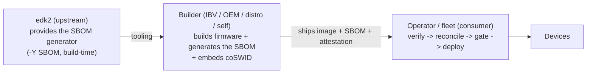
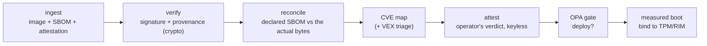

# A firmware SBOM: generate it at build, then verify it at deploy — a design for discussion

> **Status: a proposal to open a conversation, not a finished spec or a mandate.** This write-up sketches a
> shape that seems to work, backed by a running reference implementation, and asks the community whether it's
> the right shape and where it should live. Nothing here is claimed as the only way, and the honest
> limitations are called out throughout. Feedback very welcome.

## Why

Firmware SBOMs are a recognized, still-unfilled need — the UEFI Forum published a firmware-SBOM proposal, and
edk2 has an open, unassigned tracking issue ([#10507]). Two pieces are missing, and they're different kinds of
thing:

1. **A generator** — something that produces a complete, accurate SBOM *from the build itself*. A static
   CycloneDX template was seeded across ~20 upstreams (incl. edk2, [#6455]) but the edk2 one auto-closed;
   nobody built the generator the template gestured at.
2. **A verifier** — the check a *consumer* of firmware needs: "does this SBOM actually describe these bytes?"
   Existing work reads an SBOM a *cooperating builder embedded*; it can't cover firmware with no embedded SBOM,
   and it can't *verify* one against the actual image.

These belong to different actors, which is the crux of the design.

## Who does what

**edk2 is a source project** — it ships source and stable tags, never a signed firmware binary. So it can
provide the *generator* (tooling), but it does not build firmware and does not verify anyone's binary. The
firmware **builder** (IBV/OEM, a distro building OVMF, or an operator self-building) produces the image and,
ideally, the SBOM. The **operator** — the fleet/consumer — ingests someone else's firmware and has to decide
whether to trust it. Verification lives there.

**What we'd suggest contributing upstream is only the generator** (plus this write-up). The verification/gate
is an *operator-side reference pattern* others copy — deliberately **not** something edk2 hosts in its own CI
(edk2 doesn't sign firmware, so a signing/gate workflow there would be dead infrastructure).

## The two parts

### Part 1 — the generator (the upstream ask)

edk2's build already emits machine-readable component data: `build … -Y COMPILE_INFO` writes
`CompileInfo/module_report.json` (authoritative built-module set, resolved library instances, source `.inf`,
package deps), and `<FvName>.Fv.txt` gives FV placement. A generator is a **post-build consumer** of that
data — no build-system surgery, no binary parsing, no new heavy dependency (CycloneDX is JSON). It answers
#10507 directly and is the automated generator #6455 lacked. The natural upstream form is a native
`-Y SBOM` report type in `BuildReport.py`, reusing the same data.

*(A working standalone implementation exists and produces a 324-component CycloneDX SBOM from an OVMF build,
with module→library dependency edges, submodule versions, FV placement, and per-module source provenance.)*

### Part 2 — the operator verification + gate (a reference pattern)

Once a firmware + SBOM reach an operator, the pipeline is: **verify → reconcile → CVE → attest → gate → bind**.
The novel piece is **reconcile**.

Three *different* questions, three mechanisms, in order — this is the part most easily conflated:

| Question | Mechanism |
|---|---|
| Is it authentic, built where it claims? | **signature + SLSA provenance** verification (cosign, keyless identity) |
| Does the authenticated SBOM describe *these bytes*? | **reconcile** — carve the image → observed set, diff vs declared |
| Given all verdicts, may it deploy? | **OPA policy gate** — ANDs the facts |

A signature proves *who* signed and that it wasn't altered in transit — **not** that the SBOM is *accurate*.
Reconcile is what turns a signed *claim* into a checked *fact*. That's the "verify, don't trust" primitive,
and it's the thing we'd most like the community's view on (including whether it should be standardized, e.g.
as a reconcile/VEX evidence type).

## The three lenses

**Security.** What the gate defends against: a signed-but-inaccurate SBOM (reconcile catches it); a component
swapped after SBOM generation (shows as `modified`); an artifact from an unexpected builder (provenance
identity check); a known-critical CVE reaching the fleet (CVE gate + VEX triage); and drift across the fleet
(measured-boot binds the approved image). Trust boundaries: generation + signing run inside an **isolated
builder** with the builder's own **keyless OIDC identity** (not any human key), on a protected trigger; the
CI actions are **SHA-pinned** and inventoried in a signed **build-tools SBOM** so the toolchain is evidence
too. **Honest limitations:** in the reference demo the reconcile verdict is a *committed* input rather than
regenerated in CI (a real pipeline regenerates it in the builder, where the firmware is present); the
build-tools SBOM lists direct tools, not their transitive deps; and one lane (a second tool) runs compliance
in report mode, not as a gate. These are documented, not hidden.

**Functional.** Every gate input is derived from evidence: the signer identity is extracted from the verified
certificate; the SBOM's real digest is bound to the signed attestation subject; the reconcile verdict is
decoded from the signed payload; CVEs come from a real scan with a VEX allowlist for triaged findings. The
policy engine only *decides* — it gathers nothing. The same policy intent is expressible in cosign's native
rego and in an independent tool, so the outcome isn't tool-locked.

**Operational.** For a fleet operator this is a normal release-then-deploy flow: the builder produces the
firmware + SBOM + provenance; the operator ingests, verifies, reconciles, CVE-triages (a real VEX loop — a
raw scanner over coarse firmware CPEs over-reports, so triage is required, not optional), gates, and only
then rolls out — binding the approved image to measured boot. A blocked deploy is a normal, expected event
that routes to triage, not a failure.

## Relationship to existing work (not a new integration point)

- **coSWID / uSWID / fwupd** (embedded SBOM, on-device): complementary. One canonical SBOM (content hash `H`)
  projects three ways — embedded coSWID for the device, a signed attestation for the gate, a measured-boot
  RIM for runtime — all resolving to the same `H`. This is meant to *fit* the existing embedded-SBOM plan,
  not compete with it.
- **SLSA / in-toto / sigstore / OPA:** used as-is. The provenance, signing, and policy are stock; the new
  pieces are the generator and reconcile.

## What we'd propose to contribute upstream (pending community interest)

- The **`-Y SBOM` generator** in-tree (or standalone first, promoted later), reusing `-Y COMPILE_INFO`.
- This **design write-up** on #10507 to get the shape reviewed.
- (Separately, operator-side and not upstream:) the reconcile verifier + the gate reference workflow, as a
  copy-me pattern.

## Open questions for the community

1. Is `-Y SBOM` (a `BuildReport.py` report type) the right home for the generator, or a standalone tool?
2. CycloneDX vs SPDX as the primary format (the reference emits CycloneDX and converts to SPDX)?
3. Is **reconcile** (declared-vs-observed) worth standardizing as an evidence/VEX type, or left to operators?
4. Does the coSWID/measured-boot unification (`same H, three channels`) match the direction of the embedded
   SBOM work?
5. Where should the boundary sit between "edk2 provides" and "operator does" — is the generator-only upstream
   ask the right scope?

## Non-goals / honest scope

Not a claim that firmware SBOMs are solved; not a finished spec; not a request to host a signing pipeline in
edk2. Blob coverage is partial (FSP/microcode/ME have no build report — the generator is exact only for what's
built from source). The reference targets OVMF/edk2 for reproducibility. Defensive use only.

[#10507]: https://github.com/tianocore/edk2/issues/10507
[#6455]: https://github.com/tianocore/edk2/pull/6455
