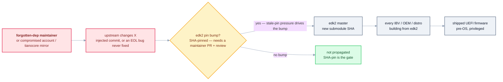

# edk2 third-party dependency tree & supply-chain posture

> **Status: defensive research for hardening / responsible disclosure.** This maps edk2's vendored
> third-party submodules, their sub-dependencies, and each one's maintenance/security posture, to answer one
> question: *can a maintainer of a forgotten dependency affect UEFI and the whole edk2 community by changing
> something?* The honest answer is nuanced — edk2's commit-pinning blocks silent propagation, but stale pins,
> abandoned projects, and org-controlled mirrors leave a real residual path. Nothing here is an exploit; it is
> a risk map. Companion to [`FRAMEWORKS.md`](./FRAMEWORKS.md) and [`DESIGN.md`](./DESIGN.md).

## The headline

- **13 `.gitmodules` entries → 12 unique upstream projects** (brotli is vendored twice: runtime + build-time).
- **None appear as identified components in edk2's SBOM today** (0 `purl`s) — they are invisible to inventory
  and CVE mapping. *This is exactly what generator Tier-2 fixes.*
- **The shipped-firmware tree is shallow** — almost every submodule is a *leaf* in the compiled path; the
  grandchildren (mbedtls-framework, googletest, pugixml, libspdm's own crypto submodules) are **test-only or
  not compiled into firmware**. Depth lives in the *build/test* chain, not the shipped image.
- **edk2 pins every submodule by commit SHA** — a malicious upstream change does **not** auto-propagate. This
  is the single most important structural defense (and it validates the pinning discipline the demo enforces).
- **The residual risk is the pin-bump path**: staleness creates pressure to "update," and a bump pulls
  whatever is at the new SHA, gated only by human PR review — exactly where an obfuscated (xz-style) change is
  designed to slip through.

## The dependency tree

Grouped by the axis that actually determines blast radius — **shipped-runtime vs dev/test-only** — and colored
by supply-chain risk verdict. Pin year shown to expose staleness.

```mermaid
%%{init: {"theme":"base","themeVariables":{"fontFamily":"ui-sans-serif, system-ui, -apple-system, sans-serif","fontSize":"13px","lineColor":"#94a3b8","clusterBorder":"#cbd5e1"},"flowchart":{"curve":"basis","htmlLabels":true,"nodeSpacing":30,"rankSpacing":48,"padding":8}}}%%
flowchart TB
  ROOT["<b>edk2 / UEFI reference</b><br/>base of ~all x86 firmware"]
  subgraph SHIP["SHIPPED-RUNTIME — compiled into firmware images"]
    direction TB
    ONIG["<b>oniguruma</b><br/>pin 2024 · ARCHIVED / EOL<br/>Redfish servers · Scorecard 3.9"]
    OSSL["openssl<br/>pin 2026 · current<br/>default crypto"]
    BROTLI["brotli<br/>pin 2025 · current<br/>cond. decompressor"]
    MBED["mbedtls<br/>pin 2026 · opt-in crypto"]
    SPDM["libspdm<br/>pin 2025-04 · ~1yr behind<br/>security platforms"]
    TPM["TPM<br/>pin 2025 · fTPM cond."]
    JAN["jansson<br/>pin 2020 · ~6yr STALE<br/>Redfish servers"]
    FDT["libfdt<br/>via pylibfdt MIRROR · pin 2023<br/>ARM / RISC-V early boot"]
    MIPI["mipisyst<br/>pin 2023 · dormant · debug-only"]
  end
  subgraph DEV["DEV / TEST-ONLY — not in shipped firmware"]
    direction TB
    GT["googletest<br/>pin 2022"]
    CM["cmocka<br/>tianocore MIRROR · pin 2019"]
    SH["subhook<br/>tianocore MIRROR · ORPHANED"]
  end
  ROOT --> SHIP
  ROOT --> DEV
  MBED -.->|"test-only or absent"| GC1["mbedtls-framework · tf-psa-crypto"]
  SPDM -.->|"not used inside edk2"| GC2["openssl · mbedtls · cmocka"]
  MIPI -.->|"build and test only"| GC3["googletest · pugixml"]
  classDef worst fill:#ffe4e6,stroke:#e11d48,stroke-width:2px,color:#7f1d1d;
  classDef med fill:#fef3c7,stroke:#f59e0b,stroke-width:1.5px,color:#7c2d12;
  classDef lowmed fill:#fef9c3,stroke:#ca8a04,stroke-width:1.5px,color:#713f12;
  classDef low fill:#eef2f7,stroke:#64748b,stroke-width:1.5px,color:#0f172a;
  classDef gc fill:#f8fafc,stroke:#cbd5e1,stroke-width:1px,color:#64748b;
  classDef root fill:#e0edff,stroke:#3b82f6,stroke-width:2px,color:#0f172a;
  class ROOT root;
  class ONIG worst;
  class OSSL,BROTLI,SPDM,TPM,FDT med;
  class MBED,JAN lowmed;
  class MIPI,GT,CM,SH low;
  class GC1,GC2,GC3 gc;
  style SHIP fill:#fff7f7,stroke:#fca5a5,color:#7f1d1d;
  style DEV fill:#f5f9ff,stroke:#93c5fd,color:#1e3a8a;
```

## Per-node posture

Pin = the exact commit edk2 vendors. "CI pinning" = does the *upstream* SHA-pin its own GitHub Actions
(a future-compromise signal, not today's risk since edk2 pins by SHA).

| Submodule | edk2 pin | Maintainer / bus factor | Activity | Scorecard | Upstream CI pinning | Reachability | Verdict |
|---|---|---|---|---|---|---|---|
| **oniguruma** | 2024-12 `4ef8920` | **kkos — solo, volunteer** | **ARCHIVED / EOL (2025-04)** | **3.9** | unpinned | Redfish servers (runtime) | **WORST** |
| libfdt (pylibfdt mirror) | 2023-03 `cfff805` | Gibson/Herring, small | mirror **semi-dormant** (~15mo) | none | mirror has no CI | ARM/RISC-V early boot | MED |
| openssl | 2026-06 `8cf17aa` | Foundation+Corp, many | active | 6.3 | **unpinned (0/10)** | default crypto (runtime) | MED |
| brotli | 2025-11 `e230f47` | Google, thin | slow (2yr gap) | 7.4 | unknown | cond. decompressor | MED |
| libspdm | 2025-04 `1be116c` | DMTF / Intel | active | 6.8 | unknown | security platforms | MED |
| TPM | 2025-10 `bc29a21` | TCG consortium | active | none | Azure DevOps (unknown) | fTPM (cond.) | MED |
| jansson | 2020-05 `e9ebfa7` (=2.13.1) | **akheron — solo**, active | active (2.15.1) | 6.8 | unpinned / `@master` | Redfish servers (runtime) | LOW–MED (stale pin) |
| mbedtls | 2026-03 `0bebf8b` | Arm / TrustedFirmware | active | 7.1 | unknown | opt-in crypto | LOW–MED |
| mipisyst | 2023-03 `370b594` | MIPI Alliance, thin | **DORMANT (2023)** | none | no CI | debug/trace only | LOW |
| googletest | 2022-06 `86add13` | Google | active | 6.0 | — | **test-only** | LOW (dev) |
| cmocka | 2019-12 `1cc9cde` | cryptomilk solo + tianocore mirror | mirror current, **pin 2019** | none | mutable-tag sync | **test-only** | LOW (dev) |
| subhook | 2022-03 `83d4e1e` | **Zeex — upstream GONE**, tianocore mirror | **ORPHANED / frozen** | none | no CI | **test-only** | LOW–MED (dev) |

### Verified repo security posture (public GitHub API + Scorecard)

Signing/protection posture, pulled from public endpoints (`.commit.verification`, tag objects, the `protected`
boolean, Scorecard). The finding is stark: **commit streams are almost entirely unsigned**, so integrity of
the whole set rests on edk2's **SHA-pinning** plus a **handful of signed tags** — not on cryptographic commit
provenance.

| Repo | Commit signing (last 10) | Tag / release signing | `protected` bool | Code-Review (SC) | Push surface |
|---|---|---|---|---|---|
| kkos/oniguruma | **1/10** signed | **none** (lightweight → unsigned) | true *(moot — archived R/O)* | 0 | archived; owner-only |
| akheron/jansson | mixed (maintainer signs) | **signed + verified** (Lehtinen) | false | 6 | user; 91 contrib |
| devicetree-org/pylibfdt | **0/10** | recent tags **signed + verified** (Herring) | false | — | devicetree-org write |
| dgibson/dtc | **0/10** | signed but **`unknown_key`** (unverifiable) | false | — | user; 127 contrib |
| tianocore/edk2-cmocka | mostly unsigned | **upstream signed tags preserved** (Schneider) | false | — | **tianocore write (39 pub members)** |
| tianocore/edk2-subhook | mixed | **no tags** → pinned by raw SHA | false | — | **tianocore write (39 pub members)** |
| DMTF/libspdm | **0/10** | **weak** (lightweight/unsigned) | true | 9 | DMTF write |

**Still not externally verifiable** (honestly): exact **branch-protection rules** (required reviews, who-can-push,
force-push) return 404 for all seven without admin; **org 2FA enforcement** is `null` for tianocore/DMTF/
devicetree-org; and per-OEM DSC enablement of Redfish/SYS-T/fTPM. These are stated as unknowns, not assumed.

## The worst case — pinned

**oniguruma** is the clearest proof that a forgotten dependency is a real UEFI supply-chain issue — and it
needs **no malicious actor at all**:

- **Abandoned:** the repo was **archived read-only (~2025-04)**; the README says *"This project ended."* There
  will never be another security fix.
- **Bus-factor-1:** one volunteer author (kkos) since 2002, no org, no successor.
- **Memory-unsafe by nature:** a C regular-expression engine — historically a rich source of buffer bugs —
  operating on attacker-influenceable strings.
- **Shipped in privileged firmware:** `RegularExpressionDxe` provides `EFI_REGULAR_EXPRESSION_PROTOCOL`, pulled
  into **Redfish-enabled server/OEM firmware** (e.g. HII config filtering) — pre-OS, high privilege. (Not in
  default OVMF, which caps the blast radius to server products, not every machine.)
- **Weakest posture measured:** OSSF Scorecard **3.9/10**.

The vulnerability here is **abandonment itself**: a known future memory-safety bug in oniguruma can never be
patched upstream, yet edk2 ships it. edk2's only options become fork-and-maintain or rip-and-replace.

**Secondary flags:** *libfdt* (edk2 consumes a **semi-dormant packaging mirror**, ~15 months behind, no
Scorecard, parsing attacker-supplied **DTBs very early in ARM/RISC-V boot**); *jansson* (a **6-year-stale
pin**, `2.13.1` from 2020, feeding a memory-unsafe JSON parser remote HTTP payloads on Redfish servers).

## The core question, answered honestly

**"Can a maintainer of a forgotten dependency compromise all of edk2/UEFI by changing X?"**

- **Not silently — SHA-pinning blocks auto-propagation.** edk2 vendors an exact commit, so a poisoned upstream
  HEAD reaches no one until an edk2 maintainer bumps the pin. This is the design's pinning thesis, confirmed in
  the wild.
- **But conditionally yes — via the pin bump.** The staleness in this very table (jansson 6yr, cmocka 2019,
  oniguruma frozen) is the pressure that triggers "let's update" — and the update pulls whatever the maintainer
  (or a compromised account/mirror) placed at the new SHA. If it survives edk2's PR review, it lands at the
  base of ~all UEFI firmware. The last line of defense is **human review of one submodule-SHA bump** — exactly
  what the xz backdoor was engineered to pass.
- **Two structural seams amplify it:** (1) the **tianocore-org mirrors** (cmocka, subhook) are edk2-controlled
  ingestion points where org write-access = push access, and the cmocka sync itself runs on **mutable action
  tags**; (2) **EOL projects** (oniguruma) can never be patched, so a known bug ships indefinitely regardless
  of anyone's intent.

**So the proof stands, with the right framing:** the UEFI supply-chain issue is not "one maintainer silently
backdoors everyone" (SHA-pinning stops that) — it is that **abandonment, stale pins, and a review-gated
pin-bump path put a memory-unsafe, unmaintained parser (oniguruma) into shipping server firmware, and leave a
human-review-only gate between a poisoned dependency commit and every downstream UEFI vendor.**

**Verified refinement (Aug 2026 posture check):** the data sharpens both ends. For **oniguruma**, the archived
(read-only) status is a real platform-level brake — no new commit/PR/tag can land without the sole owner
un-archiving — *but* the pin-bump path is **integrity-blind**: 1/10 recent commits signed, tags lightweight
and unsigned, so an owner-account compromise (un-archive → retag) would be **cryptographically undetectable**
to a consumer. For the **tianocore mirrors**, the push surface is *wider* than the personal upstreams (any of
the org's 39+ writers, `protected: false`), making tampering more credible — but two verified brakes hold:
**subhook has no tags so edk2 pins it by raw SHA** (a changed mirror commit = changed SHA = pin mismatch), and
**edk2-cmocka preserves upstream's signed+verified tags** (a malicious retag would fail GPG against Andreas
Schneider's key) — *provided edk2's consumption actually validates them*. The systemic finding: **commit
streams are essentially unsigned across the set** (0/10 on pylibfdt, dtc, libspdm), so the only integrity
anchors are edk2's SHA-pins plus a few signed tags.

## What defends against it (ties back to the design)

- **SHA-pinning** — the structural block on silent propagation (edk2 already does this; the demo enforces the
  same for CI actions).
- **A real SBOM with submodule components + hashes** (generator Tier-2) — makes these 12 projects *visible* and
  CVE-mappable instead of invisible; the SHA-512 hashes (Tier-1, shipped) let a consumer detect a swapped pin.
- **Reconcile** — catches a declared-vs-shipped mismatch, but **not** a backdoored-yet-declared dependency;
  that gap is the *ingest* problem (S2C2F) this map documents.
- **Posture monitoring** — Scorecard + staleness + EOL tracking of the dependency set as a standing signal, so
  a bump toward an abandoned or freshly-compromised upstream is flagged before review.

## Concrete hardening actions (verified build-safe)

| Action | Status | Note |
|---|---|---|
| **jansson 2.13.1 → v2.15.1** | **blocked (build fails)** | Fork PR [houdini91/edk2#3] opens the change, but the **RedfishPkg test-build FAILS**: jansson **v2.14+** added `sprintf(buf, "%#.0f", 1.0)` in `strconv.c` `get_decimal_point()` (commit "Use sprintf() to determine locale's decimal point"), and edk2's freestanding `Crt/stdio.h` provides no `sprintf` → `-Werror=implicit-function-declaration`. No clean intermediate version exists (v2.14 onward all affected). Bumping past 2.13.1 requires an edk2 `sprintf` shim in JsonLib — a real port task. **This compat drift is itself likely why the pin is 6 years stale.** A `sprintf`→`RedfishAsciiSPrint` shim was tried: it **compiles**, but edk2's `AsciiSPrint` has no `%f`, so `get_decimal_point()` returns garbage and `json_real` (decimal) output would be wrong — not upstream-clean. **Decision: hold at v2.13.1**; PR #3 closed. The incompatibility stands as the finding. |
| **oniguruma** | **no bump — issue filed** | fork gitlink already == final EOL tag `v6.9.10`; the action is *document EOL / plan replacement of `RegularExpressionDxe`*, not a pin change. Tracked as a draft edk2 issue for review: [houdini91/edk2#4](https://github.com/houdini91/edk2/issues/4) (not posted upstream). |
| **libfdt → v1.8.x** | **blocked** | the `pylibfdt` mirror edk2 consumes tops out at v1.7.2; can't pin v1.8.x until the mirror syncs — itself a mirror-lag finding. |
| **cmocka 2019 → 1.1.8** | optional | test-only (not shipped); 1.1.8 clean, 2.0.x is breaking. Low priority. |
| **verify signed tags where they exist** | recommendation | edk2 could validate the signed+verified tags on jansson / cmocka-upstream / pylibfdt; SHA-pin remains the anchor where tags are unsigned (oniguruma, libspdm, subhook). |

## Honest limitations

- 2FA / required-signed-commits / branch-protection details are org-private and not externally verifiable for
  most repos; Scorecard's Branch-Protection/Code-Review/Signed-Releases checks are the closest public proxy.
- Reachability is mechanism-confirmed (which module pulls each dep, default-off vs opt-in) but **per-OEM
  enablement** (how many shipping products turn on Redfish / SYS-T / fTPM) is not enumerable from here.
- Exact tag↔commit mappings for a few pins (oniguruma `4ef8920`) are approximate.
- The xz *tarball-injection* vector is **inapplicable** across all submodules via the edk2 path, because edk2
  builds from git submodules, not autotools release tarballs — an important narrowing.

## Sources

edk2 `.gitmodules` + submodule pins (local tree) · OSSF Scorecard `api.securityscorecards.dev` (Jul–Aug 2026) ·
per-project repos: openssl/openssl, Mbed-TLS/mbedtls, google/brotli, kkos/oniguruma, akheron/jansson,
devicetree-org/pylibfdt, MIPI-Alliance/public-mipi-sys-t, google/googletest, tianocore/edk2-cmocka,
tianocore/edk2-subhook, DMTF/libspdm, TrustedComputingGroup/TPM.
