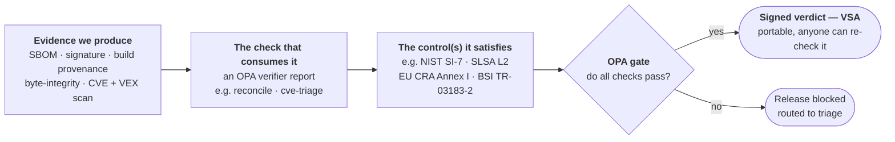

# Compliance map — evidence to specific controls, honestly

> **This is not a "we comply with SLSA / SSDF / CRA" document.** Each framework has hundreds of
> controls, most irrelevant to a firmware SBOM pipeline. Claiming whole-framework compliance would be
> meaningless. Instead this maps the **specific evidence we produce** to the **specific control (with its exact
> section/subsection number)** it satisfies, states honestly *how far* it satisfies it, and builds the case for
> the next evidence worth producing. Companion to [`DESIGN.md`](./DESIGN.md); the enforced subset lives in
> [`oss-lane/compliance-map.md`](./oss-lane/compliance-map.md).

> **In plain terms.** This document is a *map*. On one side are the pieces of **evidence** we produce about a
> firmware release — its ingredients list (an SBOM), who signed it, a record of how it was built, a
> byte-for-byte integrity result, a vulnerability scan, and more. On the other side are the specific
> **controls** that security-compliance frameworks (SLSA, NIST, EU CRA, BSI, CISA…) actually ask for. Every row
> below connects one piece of evidence to the exact control it satisfies — and, honestly, *how far*: some
> controls are **enforced now** (the release is hard-blocked if they fail), some are **satisfiable from
> evidence we already emit** but not yet wired into an automated gate, and some are **not yet possible** because
> they need a kind of evidence we don't produce. New here? Read [`PRIMER.md`](PRIMER.md) first — it explains
> firmware, SBOMs, and byte-integrity from scratch.

The chain each row walks — from a piece of evidence, through the check that consumes it, to the control it
satisfies, to the signed verdict:



## Posture in three tiers

- **Enforced today** — the deploy pipeline **hard-blocks the release** on **eighteen OPA verifier reports** (SBOM
  present · attestation signature · SBOM↔subject binding · provenance identity · **SLSA L2 provenance** ·
  reconcile · CVE/VEX · **CHIPSEC platform posture** · **reconcile membership** (SI-7/CM-8(3)) · **component
  integrity** (SI-7(1)) · **VEX adjudication** (RV.1.1, high+critical) · **third-party identity** (CISA
  License/PURL, S2C2F SCA-2) · **build-tools signed** (SSDF PO.3.2 / S2C2F REB-3)). The SLSA-L2 one is additionally backed by the
  `gh attestation verify` CI hard-gate. These are the controls we can defend as *actually enforced*, not merely
  mapped. The remaining planned rules are tracked in [`POLICY-EXPANSION.md`](planning/POLICY-EXPANSION.md).
- **Satisfiable from evidence we already emit** — many named controls across SLSA, NIST SSDF/800-53/800-161,
  OpenSSF S2C2F, the CISA/NTIA SBOM elements, EU CRA, BSI TR-03183-2, and NIST 800-190 are met or partly met by
  the ten evidence artifacts — but *not wired into a gate*. Marked `EVIDENCE` / `PARTIAL`.
- **Not yet, and honestly named** — SBOM enrichment work (`PLANNED`) and the entire runtime/attestation stack
  (SP 800-193, TCG RIM, IETF RATS — `FUTURISTIC`), which needs a class of evidence we do not produce: a signed
  **TPM quote** and a signed **golden RIM**.

The single highest-value next step is enriching **one artifact** (the SBOM — add PURLs, licenses, and
third-party/submodule components), which advances ~10 controls across five frameworks at once.

## How to read this

Every row below is one link in this chain:

```
framework  →  §control (exact ref)  →  evidence that proves it  →  status  →  (if enforced) how
```

**Status legend** — the honest axis is *how real is it*, not *does it tick*:

| Status | Meaning |
|---|---|
| **`ENFORCED`** | The release is **hard-blocked if this fails** — by one of the eighteen OPA `verifier_reports` in [`firmware.rego`](./oss-lane/policy/firmware.rego) *(gate)*; the `slsa-provenance` report is additionally backed by a CI hard-gate step *(CI)*, `gh attestation verify`. The mechanism is named per row. |
| **`EVIDENCE`** | We produce the artifact/field, but no gate rule checks it yet — the control is *satisfiable from what we emit*, just not *enforced*. |
| **`PARTIAL`** | The evidence meets the control only in part; the named shortfall is in the note. |
| **`PLANNED`** | A concrete, near-term artifact change (mostly SBOM enrichment + byte-integrity reconcile) would satisfy it. |
| **`FUTURISTIC`** | Needs a new *class* of evidence we do not produce (runtime attestation: TPM quote + golden RIM). |
| **`N/A (process)`** | An organizational/process obligation (a policy, an SLA, an acquisition process) that **no build artifact can satisfy** — listed so it is visibly out of scope, not silently dropped. |

## Evidence inventory — what we actually produce (E1–E10)

Every table references these ten atoms. The ground-truth column is read from the real artifacts in this repo,
not asserted.

| # | Evidence | Format / predicate | What it proves | Ground-truth today | Enforced by |
|---|---|---|---|---|---|
| **E1** | **CycloneDX 1.6 SBOM** | in-toto SBOM predicate | declared composition of the firmware | 311 components (3 app / 108 driver / 12 firmware / 188 lib **incl. `openssl` as an in-image third-party dep with PURL/CPE/Apache-2.0**, R1); **SHA-256+512 on 122 of the 123 non-library modules** (`ResetVector`, a raw blob, is the one skip); `metadata` timestamp/authors/tools/`lifecycle:build` populated; edk2 FFS modules carry no PURL/license (no sensible PURL — N/A by design) | `sbom-present` *(gate)* — presence only |
| **E2** | **SLSA Build L2 provenance** | `slsa.dev/provenance/v1` | build origin is authentic (platform-generated) | GitHub `attest-build-provenance`, **verified green in CI** with `gh attestation verify` | `slsa-provenance` *(gate)* backed by `gh attestation verify` *(CI)*; `provenance-identity` *(gate, identity)* |
| **E3** | **Reconcile verdict + byte-integrity** | custom in-toto predicates | shipped bytes match the declared components | FMMT-carved FFS vs SBOM by GUID (**123/123 membership**) **plus byte-integrity: 122/122 modules'** shipped PE32 bytes match the declared SHA-256 (R4 — DXE direct, XIP/PEI via un-rebase canonicalization); a same-GUID swap is caught | `reconcile` + `component-byte-integrity` *(gate)* |
| **E4** | **CVE + VEX** | grype JSON + OpenVEX | no un-triaged critical vulnerability ships | scan over E1 + OpenVEX triage allowlist | `cve-triage` *(gate)* |
| **E5** | **Signature + signer identity** | cosign keyless (Fulcio/Rekor) DSSE | the signed artifact came from the expected build identity | OIDC SAN extracted from the Fulcio cert and **checked**, not asserted; **signed subject is the SBOM/attestation, not the firmware image** | `attestation-signature` + `sbom-binding` *(gate)* |
| **E6** | **VSA** | `slsa.dev/verification_summary/v1` | the gate's verdict, as portable signed evidence | `verifier.id`/`policy.uri`/`verificationResult:PASSED`/`verifiedLevels:[L2]` populated; `resourceUri` generic; no `dependencyLevels` | output artifact |
| **E7** | **Build-tools SBOM** | CycloneDX + SHA-pins | the *build* toolchain is inventoried + signed | CI actions/tools, SHA-pinned + keyless-signed; **direct only, not transitive** | `build-tools-signed` *(gate)* |
| **E8** | **SAST report** | CodeQL SARIF (keyless-signed) | static code-analysis findings | `codeql-sast` workflow — `python` (this repo's tooling, **0 findings**) on push + scoped edk2 `c-cpp` (NetworkPkg) on dispatch; **green in CI**, Security-tab uploaded, keyless-signed, and **severity-gated** (fails ≥7.0) | `codeql-sast` severity gate *(CI)* |
| **E9** | **OpenSSF Scorecard** | Scorecard SARIF (keyless-signed) | repo security-posture score | `scorecard-analysis` workflow — push + weekly; Security-tab uploaded, published to the OpenSSF API (badge), keyless-signed. Posture evidence (R5) | — (soft evidence, deliberately not a hard gate) |
| **E10** | **CHIPSEC posture** | in-toto predicate | platform-firmware protections | `producers/chipsec` — CHIPSEC modules vs the OVMF/QEMU target → `critical_passed` (applicable critical modules PASS; `NOTAPPLICABLE` HW-root checks excluded). Config assessment, not runtime measured boot (R3) | `chipsec-posture` *(gate)* |

> **The trust anchor:** the eighteen gate reports are `sbom-present` (E1), `attestation-signature` (E5),
> `sbom-binding` (E1↔E5 digest), `provenance-identity` (E2), `slsa-provenance` (E2, backed by the
> `gh attestation verify` CI hard-gate), `reconcile` (E3), `cve-triage` (E4), `chipsec-posture` (E10),
> `reconcile-membership` (E3, SI-7/CM-8(3)), `component-integrity` (E1, SI-7(1)),
> `component-byte-integrity` (E3, SI-7(1)/SR-4(3) — the shipped PE32 bytes of each byte-checkable module match
> the SBOM's declared hash; catches a same-GUID swap; XIP/PEI modules verified via un-rebase canonicalization (122/122); reported
> honestly), `vex-adjudicated` (E4, RV.1.1 —
> every high/critical CVE needs a non-empty justification), `thirdparty-identifiers` (E1, CISA License/PURL),
> `build-tools-signed` (E7, SSDF PO.3.2 / S2C2F REB-3 — the build toolchain is signed + SHA/version-pinned),
> `firmware-digest-anchor` (E1↔E3↔image — the SBOM's `metadata.component` digest `D`, the reconcile
> `image_digest`, and the digest of the **deployed `.fd`** all agree, so the whole evidence set is about
> *these* firmware bytes, not a detached JSON file), `slsa-level-floor` (E2, SR-4/SR-4(3) — SLSA level ≥ 2),
> `evidence-chain-bound` (E1/E2/E5, one subject digest across SBOM↔attestation↔provenance), and
> `signer-identity-pinned` (E5, SI-7(15)/CM-14/SR-4(1) — the cert SAN is in the trusted set) — the gate ANDs all
> eighteen and emits E6. The
> `component-integrity` rule passes only with an explicit reviewed `data.hash_exempt` entry (ResetVector), never a
> relaxed threshold.

## Cross-framework overlap — one evidence, many controls

The honest payoff of a control-level map: a single artifact satisfies clauses in several frameworks at once, so
effort spent on it is *reused*. Cells hold the **exact control ref** each evidence ticks.
**Bold** = enforced today (gate report or CI hard-gate) · `◐` = partial · plain = `EVIDENCE` (satisfiable, not
enforced) — see the per-framework tables for the exact status of every cell.

| Evidence | SLSA v1.0 | NIST SSDF 800-218 | 800-53 / 800-161 | S2C2F | CISA/NTIA elements | EU CRA | BSI TR-03183-2 | 800-190 | Runtime (futuristic) |
|---|---|---|---|---|---|---|---|---|---|
| **E1** SBOM | — | PS.3.2 | CM-8, SR-4◐ | INV-1 | name·ver·hash·ts·author·tool·context *(license,PURL,supplier: planned)* | **Annex I §II(1)** | §4, §5.2.1, §5.2.2 (name/ver/SHA-512) | — | RIM-analog◐ |
| **E2** Provenance | Prov-Exists **(L1, gate)** · **Prov-Authentic (L2, gate)** · Distribute | PO.3.3, PS.3.1 | SR-4, SI-7(15)◐ | — | — | §II(7)◐ | §8.1.15◐ | §4.1.5◐ | RATS §8.4-analog |
| **E3** Reconcile | — | — | SR-4(3)◐, SR-4(4)◐, SI-7◐, SI-7(1)◐ | AUD-3◐ | dependency◐ | — | §5.2.2 deps◐ | §4.1.5◐ | 800-193 §4.3◐, RATS §4.1 (Verifier), 800-155 |
| **E4** CVE+VEX | — | RV.1.1, RV.2.2, PW.4.4◐ | **RA-5** | **SCA-1** | — | §II(1) vuln, §II(3)◐ | §8.1.14 (CSAF-pref) | **§4.1.1** | — |
| **E5** Sig+ID | Prov-Authentic (L2) input | **PS.2.1** | SI-7(15)◐ | — | — | §II(7)◐, Annex VII 2(b) | §8.1.15 | §4.1.5◐ | RATS §4.1 (RP trust) |
| **E6** VSA | VSA `verification_summary` | PO.4.2◐ | — | — | — | — | — | — | RATS §8.4 / RP-analog |
| **E7** Build-tools SBOM | (isolation: SHA-pin) | **PO.3.2** | CM-8 (tools) | INV-1◐ | — | — | §8.4.3 (Build SBOM) | — | — |
| **E8** SAST | — | **PW.7.1**, **PW.8** | **SA-11(1)** | — | — | §II(3)◐ | — | — | — |
| **E9** Scorecard | — | PO.1◐ | — | posture◐ | — | — | — | — | — |

**Reading it:** E1, E2 and E5 are the load-bearing artifacts — each satisfies clauses in **five-plus**
frameworks. Note how few cells are **bold**: most mapped controls are *satisfiable but not enforced*. That gap
between "we emit the evidence" and "the gate blocks on it" is honest, and is what the *Gap → value* ranking
prioritizes closing.

## Reconcile: the novel control (positioning)

No regulation or firmware-SBOM effort requires verifying a declared SBOM against the shipped bytes — this is the
project's differentiator — but there *is* adjacent prior art, so the claim must be precise:
- **Binary-analysis SBOM tools** (Syft, EMBA, ONEKEY, binwalk) produce an *observed* SBOM but never diff it
  against a *declared build* SBOM.
- **Harness "SBOM Drift"** compares SBOMs across builds — not against bytes.
- **Academic (on-point):** a 2026 consumer-side-reproducibility paper argues the same thesis (a
  provenance-embedded SBOM digest is insufficient; the consumer should re-derive and compare). **UVSCAN**
  detects third-party-component violations in IoT firmware — nearest conceptual prior art.

**Precise claim:** *reconciliation of a declared **build** SBOM against the **observed firmware bytes**, gated by
policy* — ahead of vendor practice, matching cutting-edge research. **Not** "we analyze firmware bytes" (many do),
**not** "first firmware SBOM." It verifies **byte-level integrity** of all 122 hashable modules (R4 — DXE
directly, XIP/PEI via un-rebase canonicalization) on top of GUID membership, so a same-GUID trojan is caught.

## Gap → value: the case for the next evidence to produce

Ranked by **controls-advanced per unit of effort**, using the overlap matrix.

1. **In-image third-party identity — DONE (R1).** The generator now emits the vendored submodules *actually
   linked into the image* with PURL/version/SPDX-license/CPE/supplier + a `dependsOn` edge from the consuming
   library. For OVMF X64 that is **openssl (openssl-3.5.7)** — the one in-image submodule — advancing (for that
   component): BSI §5.2.4 CPE/PURL, CISA'26 License + Software-Identifiers + Supplier, CRA Annex I §II(1)
   identification, S2C2F SCA-2; and its CPE lets the CVE gate map real openssl CVEs. **Honest scope correction:**
   it is *one* component, **not ~13** — this image only links openssl (mbedtls/oniguruma/jansson/libspdm/… belong
   to other platforms), and PURL/license are N/A for edk2 FFS modules by design. So these cells move to `PARTIAL`
   (satisfied for the in-image third-party dep), not fully. The generator generalizes per-artifact — a Redfish or
   ARM build would emit jansson/libfdt/etc.
2. **Byte-integrity reconcile (E3): compare a canonicalized per-region digest, not just membership.** Advances
   SR-4(3) "not altered", SI-7 / SI-7(1), S2C2F AUD-3 from `PARTIAL` toward strong. **Not** a naive digest match:
   in-FV modules are rebased/relocated, so it needs re-canonicalization image-side (the reconcile verdict already
   shows `modified_skipped` for exactly this reason), and `ResetVector` has no reference hash at all. E1's
   GenFw-rebase-0 SHA-512 is the *starting* reference, not a drop-in — but it makes the digest **triply
   motivated** (reconcile + BSI + CISA).
3. **Wire remaining evidence into gate rules (`EVIDENCE` → `ENFORCED`).** The `slsa-provenance` report now gates
   the L2-verified fact so the VSA lists it (**done** — R0a). Next: a per-component-hash-present check and a
   populated VSA `dependencyLevels`. Low effort; converts satisfiable-but-unenforced controls into enforced ones.
4. **CSAF/VEX document (BSI §8.1.14).** Convert E4's OpenVEX to CSAF for the BSI-named format. Low effort.
5. **Runtime attestation (the FUTURISTIC block).** A signed **TPM quote** (Attester/Evidence) + a signed
   **golden RIM** (Reference Values) unlocks the *entire* SP 800-193 §4.3 Detection, RATS §8.x, TCG RIM, and
   800-155 set at once. High effort, new evidence class — the honest long-horizon item.

**Analysis/test evidence — a new category (now enforced).** The `codeql-sast` workflow produces CodeQL SARIF
(**E8**), keyless-signs it, and **severity-gates** it (fails on high/critical ≥7.0) — our first *code-analysis*
evidence, moving SSDF PW.7/PW.8 and 800-53 SA-11(1) from `N/A` to **`ENFORCED (CI)`**. (It is a hard CI gate on
the SAST workflow; making it a required status check would also block merges/deploys on it.) **CHIPSEC**
platform-security assessment (R3) and **fuzzing** (R8) extend this same category — see
[`EVIDENCE-ROADMAP.md`](planning/EVIDENCE-ROADMAP.md).

---

# Detailed control tables (reference)

## A. Build & supply-chain frameworks (real coverage)

### SLSA v1.0 — Build track

The distinguishing axis is the **trust boundary**: *who generates/signs provenance relative to the build's
control plane*, not merely "is it signed." Requirement names are verbatim from `slsa.dev/spec/v1.0/requirements`.
(v0.1 terms — "Scripted build", "Hermetic", "Parameterless" — are **not** v1.0 controls and are not cited.)

| Level · Requirement | Ask | Evidence | Status | Note |
|---|---|---|:--:|---|
| L1 · **Provenance exists** | provenance generated for the artifact | E2 | **ENFORCED** *(gate)* | `provenance-identity` checks builder/source identity. |
| L1 · **Distribute provenance** | make it available to consumers | E2, E6 | **EVIDENCE** | E6 VSA is the distributable summary. |
| **L2 · Provenance is authentic** | signed by the build **control plane**, not the tenant job | E2 (+E5) | **ENFORCED** *(gate + CI)* | Asserted by the `slsa-provenance` verifier report (so the VSA lists it), backed by `attest-build-provenance` (platform-generated) + the `gh attestation verify` CI hard-gate (green). The offline demo, lacking `attest-build-provenance`, does not establish L2 — opt-in `DEV_ASSUME_SLSA` for local runs, loudly warned. |
| L2 · **Hosted** | build runs on a hosted platform, not a workstation | E2 | **EVIDENCE** | GitHub-hosted runner. |
| L3 · **Provenance is unforgeable** | signing material unreachable by build steps | — | **FUTURISTIC** | Needs an isolated/hardened builder (e.g. `slsa-github-generator`). |
| L3 · **Isolated** | builds cannot influence one another | — | **FUTURISTIC** | As above. |

**We are L2** for the SBOM artifact as handled by this operator-side workflow — *not* a claim about the upstream
edk2 firmware build. L3 is the honest remaining gap.

### NIST SSDF — SP 800-218 v1.1 (task text verbatim from the standard)

| Task | Ask | Evidence | Status | Note |
|---|---|---|:--:|---|
| **PS.2.1** | make software-integrity verification info available to acquirers | E5, E1 | **ENFORCED** *(gate)* | `attestation-signature`; keyless sig + extracted signer identity. |
| **PS.3.1** | archive integrity + provenance data per release | E2, E1, E5 | **PARTIAL** | Artifacts produced/stored (E2 as attestation); a retention *policy* is the missing process half. |
| **PS.3.2** | collect + share provenance for **all** components (e.g. an SBOM) | E1, E2 | **PARTIAL** | E1 exists but omits PURLs/licenses/**submodule components** → "all components" not yet met. |
| **PO.3.2** | deploy/operate tools securely; verify tool integrity & provenance | E7, E2 | **ENFORCED** *(gate)* | `build-tools-signed` hard-gates on the E7 build-tools SBOM being present, signed, and every component SHA/version-pinned (direct only). |
| **PO.3.3** | configure tools to emit artifacts evidencing secure practices | E2, E6, E1, E7 | **EVIDENCE** | Provenance + VSA + SBOMs are exactly these artifacts. |
| **PO.4.2** | automate collection/enforcement of security-check results | E6, E4 | **PARTIAL** | E6 VSA is the signed gate verdict; defining the criteria (PO.4.1) is process. |
| **PW.4.1 / PW.4.4** | acquire + continuously verify third-party components (vuln + integrity) | E4, E5, E1 | **PARTIAL** | E4/E5 cover the checks; capped by E1's missing third-party components. NIST maps PW.4.4 → SR-4(3)/SR-4(4). |
| **RV.1.1** | ongoing vuln discovery across components | E4 | **ENFORCED** *(gate)* | `cve-triage` (grype over the SBOM). |
| **RV.2.2** | plan + record risk response per vuln | E4 | **ENFORCED** *(gate)* | `vex-adjudicated`: every high/critical CVE must carry a non-empty VEX justification (a recorded, reviewed risk response) — not just allowlist membership. |
| **PW.7.1 / PW.7.2** | code review / **static code analysis** | E8 | **ENFORCED** *(CI)* | CodeQL SARIF, keyless-signed + severity-gated in `codeql-sast` (fails ≥7.0 high/critical). (grype/E4 is SCA, not SAST — do not map E4 here.) |
| **PW.8 / RV.1.2** | code-level testing to find vulns | E8 | **ENFORCED** *(CI)* | Same CodeQL SAST gate; dynamic/fuzz testing is roadmap R8. |
| **RV.1.3** | vulnerability-disclosure policy | — | **N/A (process)** | No artifact; a CVD/PSIRT policy. |

### NIST SP 800-53 Rev 5 / SP 800-161r1 (C-SCRM overlay; SR/SI/CM/RA)

800-161r1 uses the 800-53 SR-family catalog; IDs are identical. Control statements verified for SR-4/SR-11.

| Control | Ask | Evidence | Status | Note |
|---|---|---|:--:|---|
| **SR-4 / SR-4(3)** Provenance / genuine-and-not-altered | valid provenance; validate not-altered | E2, E1, E3 | **ENFORCED** *(gate)* | `slsa-level-floor` (level ≥2) + `evidence-chain-bound` (SBOM↔attestation↔provenance one digest) + `reconcile-membership`. |
| **SR-4(3)** Validate as Genuine and Not Altered | received components are genuine + unaltered | E5, E2, E3 | **PARTIAL** | E5/E2 validate the build output; **E3 is membership-only → "not altered" at byte level unproven.** |
| **SR-4(4)** Supply Chain Integrity — Pedigree | validate internal composition + provenance of critical products | E1, E3 | **PARTIAL** | Composition touched; no critical-component pedigree; E1 omits submodules. |
| **SI-7** Software/Firmware/Information Integrity | detect unauthorized changes to software/firmware | E1, E3, E5, E2 | **ENFORCED** *(gate)* | `reconcile-membership` (declared==observed, no undeclared artifact) + `component-integrity` (every hashable module hashed). Byte-level integrity of each region is R4. |
| **SI-7(15) / CM-14** Code Authentication / Signed Components | authenticate the signed component by a trusted identity | E5 | **ENFORCED** *(gate)* | `signer-identity-pinned`: signature verified **and** cert SAN in `data.trusted_signer_identities`. (Signed subject is the SBOM/attestation; firmware-byte authentication is R4. OIDC-issuer pinning is a documented enhancement.) |
| **SI-7(1)** Integrity Checks | integrity checks over components | E1 | **ENFORCED** *(gate)* | `component-integrity`: every hashable non-lib module carries a hash, or an explicit reviewed `data.hash_exempt` entry (ResetVector — a raw blob). No relaxed threshold; goes RED otherwise. |
| **CM-8 / CM-8(3)** Component Inventory / Unauthorized Component Detection | accurate inventory; detect unauthorized components | E1, E3, E7 | **ENFORCED ◐** *(gate)* | CM-8(3) enforced via `reconcile-membership` (`undeclared_observed==0`). CM-8 base inventory: E1 (openssl identified; edk2 FFS N/A); E7 tools direct-only. |
| **RA-5** Vulnerability Monitoring & Scanning | scan for vulnerabilities; remediate per risk | E4 | **ENFORCED** *(gate)* | `cve-triage`; cadence to be documented. |
| **SA-11 / SA-11(1)** Developer Testing & Evaluation / Static Analysis | run static code analysis during development | E8 | **ENFORCED** *(CI)* | CodeQL (`codeql-sast`) is exactly SA-11(1); keyless-signed + severity-gated. |
| **SR-11** Component Authenticity | anti-counterfeit **policy** + detection | — | **N/A (process)** | E5/E3 give own-build authenticity but are **not** an anti-counterfeit program — do not claim. |
| **SR-3 / SR-5** Processes / Acquisition | documented C-SCRM processes / acquisition strategy | — | **N/A (process)** | Evidence implements pieces; the documented *process* is out of scope. |

### OpenSSF S2C2F v2 (practice IDs verbatim)

| Practice | Ask | Evidence | Status | Note |
|---|---|---|:--:|---|
| **INV-1** | automated inventory of all OSS used | E1, E7 | **PARTIAL** | E1 build-generated but no submodules; E7 direct-only. |
| **SCA-1** | scan OSS for known vulnerabilities | E4 | **ENFORCED** *(gate)* | Direct hit (`cve-triage`). |
| **AUD-3** | validate integrity of OSS consumed into the build | E3 | **PARTIAL** | Reconcile is membership-only — partial integrity signal. |
| **SCA-2** | scan OSS for licenses | E1 | **ENFORCED** *(gate)* | `thirdparty-identifiers` requires a license on every third-party component. |
| **SCA-3** | scan OSS for end-of-life | — | **PLANNED** | Needs an EOL feed. |
| **AUD-1** | verify provenance of **ingested** OSS | — | **N/A / not-forced** | E2/E5 is provenance of *our own output*, a different subject — do not map. |

### in-toto attestation + SLSA VSA (evidence-format controls)

| Control | Ask | Evidence | Status | Note |
|---|---|---|:--:|---|
| in-toto **Statement `_type` v1** | standard statement envelope | E2, E6 | **EVIDENCE** | Both use the v1 Statement wrapper. |
| **subject→digest binding** | attestation bound to a specific artifact digest | E1, E5, E6 | **ENFORCED** *(gate)* | `sbom-binding`: SBOM digest == signed subject. |
| **DSSE signing** | attestation wrapped in a signed DSSE envelope | E5 | **ENFORCED** *(gate)* | Cosign keyless DSSE; OIDC identity. |
| VSA **`verifiedLevels`** | machine-readable level asserted | E6 | **EVIDENCE** | Reads `SLSA_BUILD_LEVEL_2` on allow; note it is *asserted on the pass verdict*, and gate-verified for real only in CI where `gh attestation verify` runs. |
| VSA **`dependencyLevels`** | SLSA levels of transitive deps | — | **PLANNED** | Empty today — ties to the E1/E3 transitive-coverage gap. |

## B. SBOM-content regulation (CRA / BSI / CISA / NTIA)

**The nuance first: CRA-the-law is field-light; the teeth are in BSI/CISA.** CRA requires an SBOM to *exist*,
be machine-readable, and cover *at least top-level dependencies* — **it names no fields and no format**. The
operational bar auditors use is **BSI TR-03183-2 v2.1.0** (CRA's harmonized-standard-in-waiting) and the
**CISA 2026 Minimum Elements**. So E1's missing licenses/PURLs are **not CRA gaps** — they are BSI/CISA gaps.

### EU CRA — Regulation (EU) 2024/2847 (Annex I **Part II** = vulnerability handling; text quoted)

| Ref | Ask (quoted) | Evidence | Status | Note |
|---|---|---|:--:|---|
| **Annex I, Part II(1)** | "…draw up a **SBOM in a commonly used and machine-readable format covering at the very least the top-level dependencies**" | E1, E4 | **ENFORCED ◐** *(gate: `sbom-present`)* | Existence + format are gate-enforced (CycloneDX 1.6). The component leg is thin: no identifiers/submodules to *demonstrate* the dependency set. E4 documents the "vulnerabilities" clause. |
| **Annex I, Part II(2)** | "address and remediate vulnerabilities without delay…" | E4 | **N/A (process)** | VEX feeds the decision; the remediation act/SLA is process. |
| **Annex I, Part II(3)** | "apply effective and regular tests and reviews…" | E4, E8 | **PARTIAL** | Recurring CVE scan (E4) + CodeQL SAST (E8) are two review types; pen-test/fuzz cadence (roadmap R8) would strengthen. |
| **Annex I, Part II(7)** | "mechanisms to **securely distribute updates**…" | E5, E2 | **PARTIAL** | Signing + provenance give the integrity primitives; the distribution channel isn't evidenced. |
| **Annex VII, 2(b)** | tech-doc must include the **SBOM**, CVD policy, contact address, secure-update solution | E1, E5, E2 | **PARTIAL** | SBOM + secure-update solution present; CVD policy + contact address are process artifacts. |

*Legal precision:* CRA does **not** name CycloneDX/SPDX and does **not** require licenses/PURLs/nested deps
(Recital 77; Annex I Part II(1)). It must be kept current across patches and retained as technical documentation
(Art. 31 / Annex VII).

### BSI TR-03183-2 v2.1.0 — SBOM data fields as discrete controls

Tiers (§5.2): **Required** = always mandatory · **Additional** = mandatory *when the data exists*.

| Ref | Field | Tier | Evidence | Status | Note |
|---|---|:--:|---|:--:|---|
| **§4** | format = CycloneDX **≥1.6** (or SPDX) | Req | E1 | **EVIDENCE** | E1 is CDX 1.6 — meets the floor exactly. |
| **§5.2.1 / Table 2** | SBOM creator + timestamp | Req | E1 metadata | **EVIDENCE** | `metadata.authors`=TianoCore + `metadata.timestamp` populated (verified). |
| **§5.2.2 / Table 3** | component name + version | Req | E1 | **PARTIAL** | Names present; ~291/310 versions default to `1.0` (weak). |
| **§5.2.2 / Table 3** | **hash of deployable component — SHA-512** | Req | E1 | **EVIDENCE** | Strong match: SHA-512 on 122 of the 123 modules (GenFw rebase-0 canonical, deployable form). |
| **§5.2.2 / Table 3** | dependencies (with completeness flag) | Req | E1, E3 | **PARTIAL** | Module→library edges exist; **submodule dependency graph absent**; no completeness flag. |
| **§5.2.2 / Table 3** | distribution licences (SPDX IDs) | Req | — | **PLANNED** | E1 has no licenses. |
| **§5.2.2 / Table 3** | component creator / filename | Req | — | **PLANNED** | Not emitted (bom-ref is the GUID, not a filename). |
| **§5.2.2 / Table 3** | executable / archive / structured properties | Req | — | **PLANNED** | BSI publishes a [CycloneDX property taxonomy](https://github.com/BSI-Bund/tr-03183-cyclonedx-property-taxonomy) for exactly these. |
| **§5.2.4 / Table 5** | CPE / **PURL**, source/deployable URIs, original licences | Add | E1 | **PARTIAL** | Satisfied for the in-image third-party dep (openssl: PURL+CPE+Apache-2.0, R1); edk2 FFS modules have no sensible PURL (N/A by design). |
| **§8.1.14** | vulnerability data → **CSAF (VEX profile)** | rec | E4 | **EVIDENCE** | Triage authored as OpenVEX (`inputs/vex.openvex.json`), converted to BSI's named **CSAF 2.0 VEX** via `producers/interop/to-csaf.py` → `inputs/vex.csaf.json` (R6). |
| **§8.1.15** | SBOM ideally digitally signed | rec | E5 | **EVIDENCE** | cosign covers it. |
| **§8.4.3** | Build SBOM | — | E7 | **EVIDENCE** | E7 aligns with the Build-SBOM concept. |

### CISA 2026 Minimum Elements (finalized ~July 2026) + NTIA 2021

The **CISA 2026 Minimum Elements** (finalized ~July 2026, superseding the NTIA 2021 baseline) add four fields:
**Component Hash, License, Generation Tool, Generation Context**.

| Element | Source | Evidence | Status | Note |
|---|---|---|:--:|---|
| Component name / version | NTIA'21 | E1 | **EVIDENCE** | Present. |
| **Supplier name** | NTIA'21 (retained '26) | E1 | **PARTIAL** | Only via `metadata.authors` (SBOM author ≠ per-component supplier); per-component supplier is `PLANNED`. |
| **Component Hash** | CISA'26 new | E1 | **EVIDENCE** | Per-module SHA-256/512 — meets the new integrity field on 122 of 123 modules. |
| **License** | CISA'26 new | E1 | **ENFORCED** *(gate)* | `thirdparty-identifiers`: every third-party component (openssl: Apache-2.0) must carry a license; edk2 FFS excluded by construction. |
| Software Identifiers (PURL/CPE) | NTIA'21 "other IDs" | E1 | **ENFORCED** *(gate)* | `thirdparty-identifiers`: purl (+CPE) required on every third-party component; edk2 FFS N/A by construction. |
| Dependency relationship | NTIA'21 | E1, E3 | **PARTIAL** | Internal edges only; no transitive/submodule graph. |
| Author of SBOM data | NTIA'21 | E1 | **EVIDENCE** | `metadata.authors` populated. |
| Timestamp | NTIA'21 | E1 | **EVIDENCE** | `metadata.timestamp` populated. |
| **Generation Tool** | CISA'26 new | E1 | **EVIDENCE** | `metadata.tools` = the `-Y SBOM` generator (name+version). |
| **Generation Context** | CISA'26 new | E1 | **EVIDENCE** | `metadata.lifecycles:[{phase:build}]` — build-time is the gold-standard context. |
| Automation support (format) | NTIA'21 | E1 | **EVIDENCE** | CycloneDX 1.6. |
| Completeness (transitive) | CISA'26 | E1 | **PARTIAL** | No submodule components. |

**Verdict:** CRA (law) **passes** (existence + machine-readable, gate-enforced); NTIA 2021 **mostly** (weak
supplier/identifiers); **CISA 2026** and **BSI v2.1.0** **do not yet pass** — both blocked on the same
fields: **licenses, PURLs, supplier, submodule components**.

## C. Container-analog — NIST SP 800-190 (Sept 2017; §4 read directly)

800-190 predates SBOMs and has no SBOM control; the firmware image maps as the "image."

| Ref | Ask | Evidence | Status | Note |
|---|---|---|:--:|---|
| **§4.1.1** Image vulnerabilities | pipeline vuln scan + "quality gate" above a CVSS threshold | E4, E3 | **ENFORCED** *(gate)* | `cve-triage` at severity=critical is exactly the quality gate. |
| **§4.1.5** Use of untrusted images | discrete signature identity + **validate signature before execution** | E5, E2, E6, E3 | **PARTIAL** | E5/E2/E6/E3 give sign+identify+verify+tamper-detect. **Caveat:** §4.1.5 (footnote 6 → CMVP) wants a **NIST-validated (FIPS 140)** crypto implementation — Sigstore/cosign keyless is **not** CMVP-validated. |
| **§4.2.3** Registry auth/authz | signed + scanned before promotion to a registry | E5, E4 | **PARTIAL** | Pattern supported; registry admission enforcement not shown. |
| **§4.1.2** Image config defects | secure config / minimal base | — | **N/A** | Not addressed by E1–E10. |

## D. Firmware-runtime frameworks — FUTURISTIC (the honest zero)

Everything below needs a **new class of evidence we do not produce**: a signed **TPM quote** (the "Attester's
Evidence") and a signed **golden RIM** (the "Reference Values"). Where our build-time evidence is a genuine
*structural analog* (same compare-artifact-to-reference logic), it is marked `◐ analog`, never covered. *(One
`PARTIAL` row below — §4.2.1 — is met only **pre-deployment**, via the signed update image; the on-device
enforcement it asks for is still futuristic.)*

### NIST SP 800-193 (Platform Firmware Resiliency — §4; subsection numbers verified against the primary PDF)

> The principles are **not** §4/§5/§6. They are subsections of §4 — Protection **§4.2.x**, Detection **§4.3.x**,
> Recovery **§4.4.x**, with roots of trust in **§4.1.x**.

| Ref | Ask | New evidence required | Status | Note |
|---|---|---|:--:|---|
| **§4.2.1** Protection and Update of Mutable Code | only authenticated firmware updates apply | E5, E2, **E10** (CHIPSEC `bios_wp`/`bios_ts`) | **ENFORCED ◐** *(gate: chipsec-posture)* | CHIPSEC BIOS write-protection config checks are gate-enforced (config-level, OVMF target) via `chipsec-posture`; E5+E2 prove the update image is authentic. The on-device RTU + runtime enforcement remains futuristic. |
| **§4.3.1** Detection of Corrupted Code | detect corruption vs an authorized reference | measured-boot measurement + golden RIM, on-device | **FUTURISTIC ◐ analog** | Runtime twin of E3 reconcile — E3 compares *build outputs to SBOM*, not *running firmware to a reference*. |
| **§4.3.2** Detection of Corrupted Critical Data | detect critical-data corruption vs reference | as above | **FUTURISTIC** | — |
| **§4.4.1 / §4.4.2** Recovery of Mutable Code / of Critical Data | auto-recover to a known-good state | golden recovery image + on-device RTRec | **FUTURISTIC** | We can *supply* a signed known-good image (E2/E5); the recovery mechanism is runtime-only. |
| **§4.2.2** Protection of immutable code | write-protected/immutable regions | **E10** (CHIPSEC `spi_desc`/`spi_lock`) | **ENFORCED ◐** *(gate: chipsec-posture)* | CHIPSEC SPI descriptor/lock config checks touch §4.2.2 at config level on the OVMF target; hardware-enforced runtime integrity remains futuristic. |
| **§4.2.3 / §4.2.4** Runtime protection of code / critical data | hardware-enforced runtime integrity | hardware mechanism + runtime evidence | **FUTURISTIC** | CHIPSEC `smm`/`smrr` config checks are indicative, but true runtime integrity needs on-device measurement. |

### IETF RATS — RFC 9334 (roles §4.1; conceptual messages §8.x; topological models §5.x)

| Ref | Role / message | Evidence | Status | Note |
|---|---|---|:--:|---|
| **§4.1** Relying Party | consumes a verdict, gates an action | E6 + gate | **EVIDENCE (analog)** | Our VSA + deploy gate *are* the Relying-Party shape — only the input differs (build verdict vs runtime AR). |
| **§4.1** Verifier | appraises Evidence against Reference Values → result | E3 | **PARTIAL (analog)** | E3 reconcile is Verifier-shaped but appraises *build* evidence, not TPM Evidence. |
| **§8.3** Reference Values | golden values Evidence is compared to | golden RIM (below) | **FUTURISTIC** | E1/E7 SBOMs are the build-plane analog; runtime needs the RIM. |
| **§8.1** Evidence | device signs claims about its running state | **TPM quote + event log** | **FUTURISTIC** | The hard gap — no Attester, no quote. Every runtime row blocks on this. |
| **§8.4** Attestation Result | Verifier's signed verdict for the RP | signed EAT/AR4SI | **FUTURISTIC** | E6 VSA is the structural sibling, over build Evidence. |

### TCG PC Client RIM · NIST SP 800-155

| Ref | Ask | New evidence required | Status | Note |
|---|---|---|:--:|---|
| TCG PC Client RIM (exact §/Table **unverified** — primary PDF Cloudflare-gated) | publish the golden set of expected boot/firmware measurements as a **signed** manifest | a **signed golden RIM** (RIM Info Model mandates W3C XML-Signature) | **FUTURISTIC** | The Reference Values that 800-193 §4.3 and RATS §8.3 both consume. E1/E7 are component-enumeration cousins, not PCR golden hashes. |
| NIST SP 800-155 (IPD, Dec 2011; historical → folded into TCG) | measure BIOS at boot into TPM PCRs, compare to reference | measured-boot log + PCR values + reference set | **FUTURISTIC ◐ analog** | Explicit runtime ancestor of E3's "measure vs known-good" pattern; cite as lineage, not an active target. |

---

## Honest caveats (read before citing)

- **cosign keyless ≠ FIPS/CMVP.** 800-190 §4.1.5 (footnote 6 → CMVP) wants a NIST-validated crypto
  implementation; Sigstore is not CMVP-validated. State it if the audience is strict.
- **SLSA L2 is scoped to the SBOM artifact** on this operator-side workflow, not the upstream firmware build. It
  is enforced by the `slsa-provenance` verifier report, backed by the `gh attestation verify` CI hard-gate.
- **CRA is field-light** — do not attribute the license/PURL asks to CRA; they are BSI/CISA.
- **TCG PC Client RIM exact §/Table numbers are unverified** (primary PDF was gated) — read them off the spec
  before publishing anything that cites a specific RIM subsection.
- **E3 now includes byte-integrity** (R4 — 122/122 modules byte-verified) — the "not altered" claims are
  enforced by `component-byte-integrity`, not `PARTIAL`. Only TE-format / compressed sections stay out of scope.
- **SAST is enforced by a separate CI gate** (`codeql-sast` fails on high/critical ≥7.0), not by the deploy
  gate; make it a required status check to hard-block merges/deploys on it too.
- **The gate's per-report `.controls` tags are a representative subset**, not the exhaustive mapping — this
  document is the authoritative control map.

## Sources

SLSA: https://slsa.dev/spec/v1.0/requirements · VSA https://slsa.dev/spec/v1.0/verification_summary
SSDF 800-218: https://nvlpubs.nist.gov/nistpubs/SpecialPublications/NIST.SP.800-218.pdf · 800-53r5 SR-4: https://csf.tools/reference/nist-sp-800-53/r5/sr/sr-4/ · SR-11: https://csf.tools/reference/nist-sp-800-53/r5/sr/sr-11/ · 800-161r1: https://csrc.nist.gov/pubs/sp/800/161/r1/upd1/final
S2C2F: https://github.com/ossf/s2c2f/blob/main/specification/framework.md · in-toto: https://github.com/in-toto/attestation
NTIA 2021: https://www.ntia.gov/report/2021/minimum-elements-software-bill-materials-sbom · CISA 2026 Minimum Elements: https://www.cisa.gov/resources-tools/resources/2026-minimum-elements-software-bill-materials-sbom
CRA Reg (EU) 2024/2847: https://eur-lex.europa.eu/eli/reg/2024/2847/oj · BSI TR-03183-2 v2.1.0: https://www.bsi.bund.de/SharedDocs/Downloads/EN/BSI/Publications/TechGuidelines/TR03183/BSI-TR-03183-2_v2_1_0.pdf · BSI CDX taxonomy: https://github.com/BSI-Bund/tr-03183-cyclonedx-property-taxonomy
SP 800-190: https://nvlpubs.nist.gov/nistpubs/SpecialPublications/NIST.SP.800-190.pdf · SP 800-193: https://nvlpubs.nist.gov/nistpubs/SpecialPublications/NIST.SP.800-193.pdf · SP 800-155 (IPD): https://csrc.nist.gov/pubs/sp/800/155/ipd
RATS RFC 9334: https://www.rfc-editor.org/rfc/rfc9334.html · TCG PC Client RIM: https://trustedcomputinggroup.org/resource/tcg-pc-client-reference-integrity-manifest-specification/ · OSCAL: https://pages.nist.gov/OSCAL/
Reconcile prior art: https://developer.harness.io/docs/software-supply-chain-assurance/sbom/sbom-drift/ · https://www.sciencedirect.com/science/article/pii/S2405959526001086
