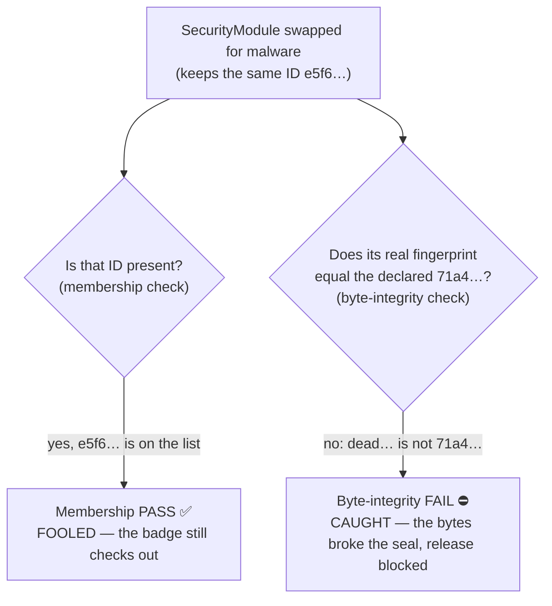
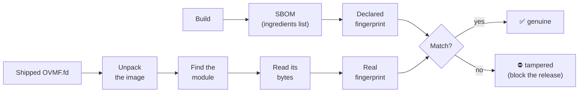
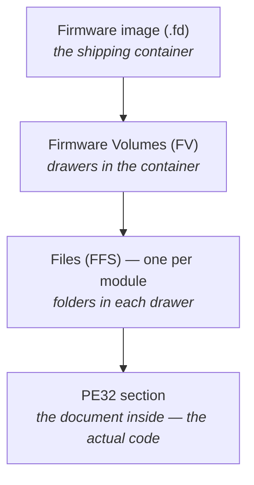
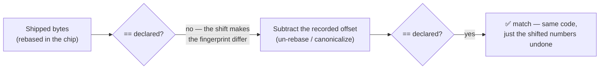

# Start here — this project in plain language

**No firmware background needed.** This page explains what the project does and why it matters, building up
from scratch. The other docs ([`README`](README.md), [`FRAMEWORKS.md`](FRAMEWORKS.md), [`DESIGN.md`](DESIGN.md))
go deeper and assume more; come back to them once this clicks.

> **In one sentence:** we take a firmware image, produce a signed "ingredients list" of everything inside it,
> then *prove* the shipped chip actually contains those exact things — and refuse to deploy it if it doesn't.

---

## Firmware in 90 seconds

Six ideas. Everything else is built from these.

| Term | What it is | A everyday analogy |
|---|---|---|
| **Firmware** | The lowest-level software baked into a device. It runs *before* the operating system and starts the machine. On a PC this is the **UEFI** firmware (the modern **BIOS**). | The building's wiring — there before anyone moves in. |
| **Module** | Firmware isn't one program; it's a **bundle of small programs** (drivers, services). An image has dozens to hundreds. | Apps on a phone — but for the chip. |
| **Firmware image** (`.fd`) | The single file "flashed" onto the chip, with all modules packed together. Ours is `OVMF.fd`. | One shipping container holding every module. |
| **Module ID** (**GUID**) | A unique label saying *which* module something is (e.g. `2ec9da37-…`). | A serial number / name badge. |
| **Fingerprint** (**SHA-256** hash) | A short code derived from a file's exact bytes. **Change one bit and it changes completely.** Same fingerprint ⇒ identical bytes. | A wax seal that shatters if touched. |
| **Ingredients list** (**SBOM**) | A signed inventory made when the firmware is built: every module, its ID, and its fingerprint. | The recipe card of exactly what should be inside. |

---

## The whole point, with a real example

Two checks *sound* the same but are worlds apart. Here's a firmware image with three modules, the way the
**SBOM** declares them:

| Module | ID (GUID) | Fingerprint |
|---|---|---|
| NetworkDriver | `a1b2…` | `5fe7…` |
| DiskDriver | `c3d4…` | `9c2a…` |
| SecurityModule | `e5f6…` | `71a4…` |

**The attack — a "same-ID swap":** an attacker rips out the real `SecurityModule` and drops in **malware** —
but keeps the **same ID (`e5f6…`)** so the inventory still looks right. Only the bytes changed, so its real
fingerprint is now different (say `dead…`, not the declared `71a4…`).

Now the two checks:

- **Membership check** *(the usual one)* — "Are IDs `a1b2`, `c3d4`, `e5f6` all present?" → **YES → PASS ✓**
  → **fooled.** The trojan kept its ID, so the inventory looks complete. Most tools stop here.
- **Byte-integrity check** *(what we built)* — "Does `e5f6`'s **real fingerprint** equal the declared `71a4`?"
  → `dead…` ≠ `71a4` → **FAIL ✗** → **caught.** The bytes don't match what the SBOM promised, whatever the ID
  says. The release is blocked.

> **In one line:** membership asks *"is the right name on the list?"* — byte-integrity asks *"is it really that
> module, or an impostor wearing its badge?"*

Here are both checks on that swapped `SecurityModule` side by side — one is fooled, one catches it:

The attacker can forge the *badge* (the ID) for free, but not the *fingerprint* — that comes from the bytes
themselves, and changing the bytes always changes it.

---

## How the verification works (high level)

The declared fingerprint comes from the SBOM. The real one we compute ourselves from the shipped image, then
compare:

Two sides meet in the middle. One side is what the build *promised*; the other is what actually *shipped* — and
we compute it ourselves rather than take anyone's word for it:

"Unpack" just means opening the nested containers inside the image: **Firmware Volumes** (FV) → **files** (FFS,
one per module) → the actual program inside (a **PE32** section). Think of it as *image → drawers → folders → the
document* — you open each layer to reach the code:

We pull that innermost document's bytes and fingerprint them, then compare to what the SBOM declared.

The full pipeline does more than byte-integrity — it also checks the image is **signed** by the expected
builder, has verifiable **build provenance**, carries **no un-triaged known vulnerabilities**, and more. Each
check becomes a rule; the release is blocked unless **all** of them pass, and the verdict itself is signed so
anyone downstream can re-check it. (Details in [`FRAMEWORKS.md`](FRAMEWORKS.md).)

---

## Byte-integrity: what we built, in three steps

This was the hardest and most novel check. A short version of the journey (full write-up:
[`planning/R4-BYTE-INTEGRITY.md`](planning/R4-BYTE-INTEGRITY.md)):

1. **Prove it works** — on the biggest group of modules (**DXE**, the "main" boot stage). For 5/5 the shipped
   bytes matched the declared fingerprint exactly; flipping **one bit** was detected.
2. **Make it a real gate — honestly** — run it over *every* module (122 of them). 111 matched directly; 11
   "looked different." Those 11 are **early-boot modules** that differ for a *benign* reason — so we label them
   "needs a fair-comparison step," **never** "tampered." A clean image stays clean; the number stays truthful.
3. **The last 11** — early-boot modules are **rebased**: when fixed into a spot in the chip, their internal
   addresses get shifted (same code, shifted numbers). The shift is recorded and fully **reversible**, so we
   subtract it back out (*"canonicalization"*) before fingerprinting. That makes them match too → **all 122
   code modules covered**, with a same-ID swap still caught in every kind of module.

The key point: the shift is a *benign, recorded* transformation, so undoing it is fair. A real tamper changes
the actual code, which no offset-subtraction can paper over — so it still fails.

---

## The bigger picture — the other checks

Byte-integrity is the headline, but the release gate ANDs **19** signed checks. The three that matter most:

- **Reconcile** — the project's name for the *membership* check above: carve the real image and confirm every
  declared module is **present** (and that nothing undeclared snuck in). "Are the right parts there?"
- **Byte-integrity** — "are the parts **genuine**?" (the same-GUID-swap check we just walked through).
- **CHIPSEC** — a *different* question on a *different* axis: are the **platform's own firmware protections**
  switched on (BIOS write-protection, Secure-Boot variables, SMM)? This is about the chip's defenses, **not**
  about matching the ingredients list.

Plus signature + build-provenance (was it built by the expected identity, verifiably?) and a vulnerability
scan (no un-triaged known CVE ships). All of it becomes **signed evidence**; the gate blocks the release unless
every check passes, and emits **one signed verdict** carrying the per-control results across seven frameworks.

## Glossary

| Term | Plain meaning |
|---|---|
| **Firmware** | Low-level software baked into a chip that runs before the OS and boots the machine. |
| **UEFI / BIOS** | The modern / older names for PC firmware. Same job: start the computer. |
| **edk2 / OVMF** | edk2 is the open-source toolkit UEFI firmware is built from; `OVMF` is an open UEFI firmware we test on. |
| **Module** | One small program inside the firmware (a driver or service). |
| **Firmware image / `.fd`** | The single binary file flashed onto the chip, holding all modules. |
| **GUID** | Globally Unique Identifier — a label saying *which* module something is. |
| **Hash / SHA-256** | A fingerprint of a file's exact bytes; one bit changes it completely. |
| **SBOM** | Software Bill of Materials — a signed inventory: every module, its GUID, its hash. |
| **Membership check** | Confirms every declared module (by GUID) is present. Ignores the bytes. |
| **Byte-integrity** | Confirms each module's shipped bytes match the declared hash. Catches a same-GUID swap. |
| **Same-GUID trojan** | Malware that replaces a module's code but keeps its GUID, so the inventory still looks right. |
| **FV / FFS / PE32** | The image's nested containers: Firmware Volume → file (one per module) → PE32 (the actual code). |
| **SEC / PEI / DXE** | Firmware boot stages: SEC (first), PEI (early init), DXE (main). Modules belong to a stage. |
| **Rebase / relocation** | Shifting a module's internal addresses when it's fixed into the chip. Reversible. |
| **Canonicalization** | Converting both sides to the same form (e.g. undoing a rebase) so a byte comparison is fair. |
| **Signing / attestation** | Cryptographically stamping evidence so its origin and integrity can be checked later. |
| **Provenance** | A verifiable record of *how and where* the firmware was built. |
| **Policy gate** | The automated check that blocks a release unless every rule passes. |
| **VSA** | Verification Summary Attestation — the signed "verdict" the gate emits (what passed, what it means). |

---

## Where to go next

- [`README.md`](README.md) — what's built vs. designed, and how to run it.
- [`FRAMEWORKS.md`](FRAMEWORKS.md) — which security-compliance controls each check satisfies (the exact rules).
- [`DESIGN.md`](DESIGN.md) — the deeper security/architecture rationale.
- [`planning/R4-BYTE-INTEGRITY.md`](planning/R4-BYTE-INTEGRITY.md) — the full byte-integrity write-up.
