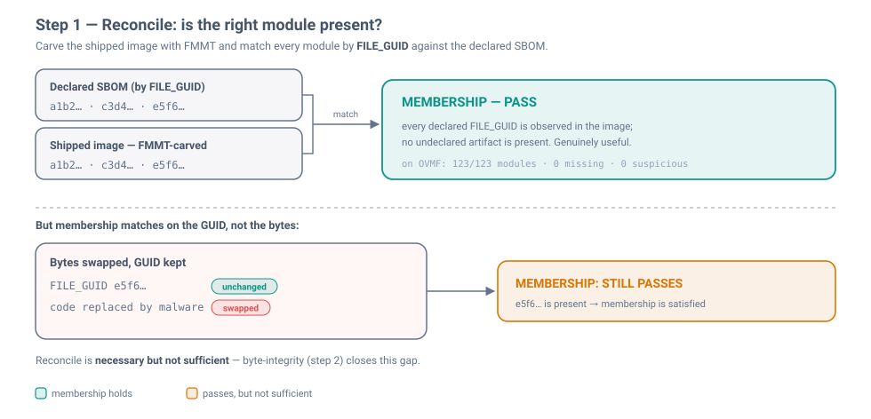
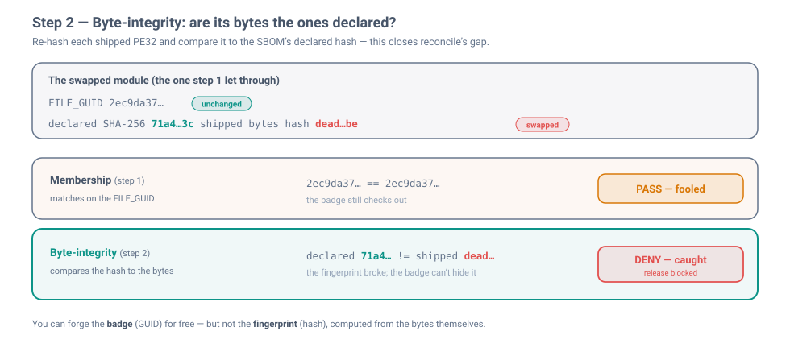
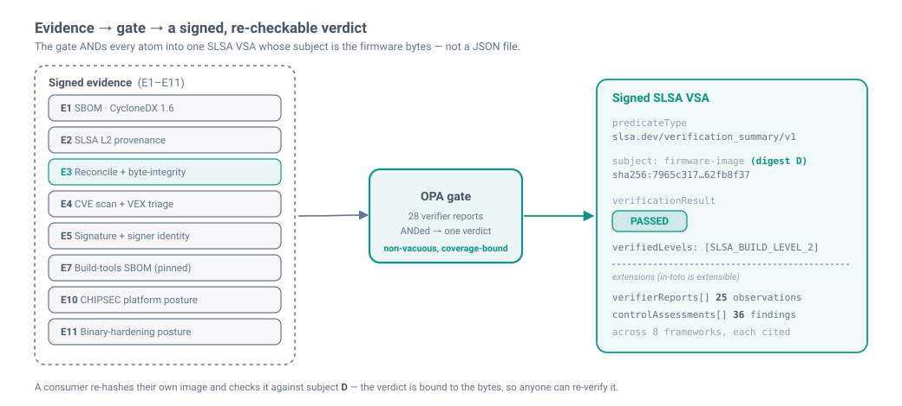
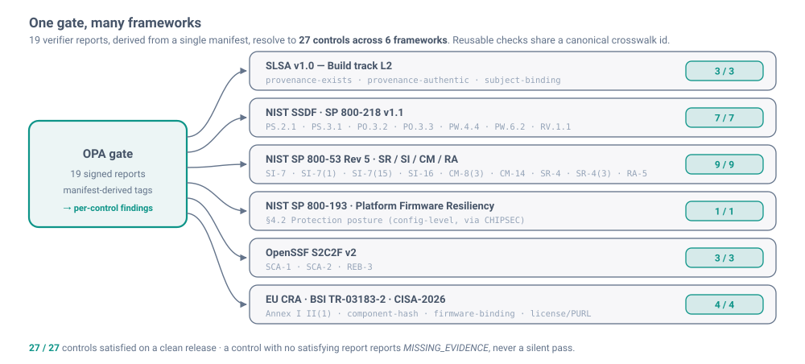
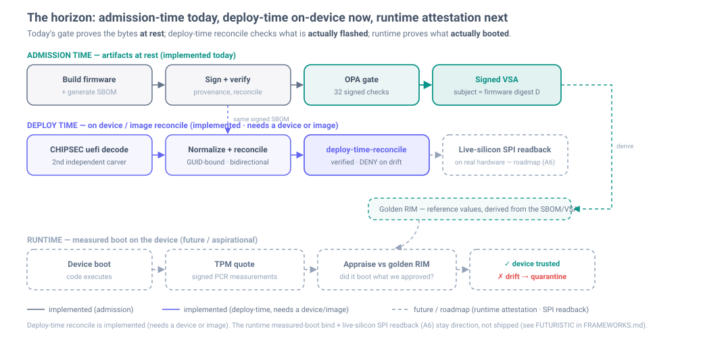

<div align="center">

# firmware-sbom-supplychain

***Prove a firmware image ships the exact code its signed bill of materials declares — and block a same-GUID trojan that signatures and inventories miss.***

[](https://github.com/houdini91/firmware-sbom-supplychain/actions/workflows/supply-chain.yml)
[](https://github.com/houdini91/firmware-sbom-supplychain/actions/workflows/pr-checks.yml)
[](https://scorecard.dev/viewer/?uri=github.com/houdini91/firmware-sbom-supplychain)


**[Primer](PRIMER.md)** · **[Design](DESIGN.md)** · **[Frameworks](FRAMEWORKS.md)** · **[Live demo output](docs/DEMO.md)** · **[Quickstart](#quickstart)**

</div>

> **Threat model.** A compromised build step swaps a module's bytes, keeps its `FILE_GUID`, and re-signs the
> image — the signature is valid and the inventory matches by ID; only the SBOM's declared **per-module hash**
> disagrees. That gap is what this gate closes.

## What it is

An **evidence-centric supply-chain gate** for firmware, built on the open **OVMF / edk2** UEFI reference target.
Every claim about a build — its SBOM, its signature, its provenance, its shipped bytes, its CVEs — becomes signed
evidence; a policy engine ANDs those facts into **one signed verdict**; the release is blocked unless the
**executable code that ships in the image** matches the signed SBOM. This is an **admission-time** gate over
artifacts at rest, not a runtime/boot measurement.

> **New to firmware, SBOMs, or GUIDs?** [**PRIMER.md**](PRIMER.md) explains it all from scratch (~2 min).

## How it works: two checks, in sequence

**Step 1 — Reconcile** carves the shipped image and confirms every declared module is present. Useful, but it
matches on the `FILE_GUID`, so a module whose *bytes* were swapped under the same GUID still passes:

<div align="center">
<picture>
  <source media="(prefers-color-scheme: dark)" srcset="docs/img/reconcile-dark.svg">
  
</picture>
</div>

> **Reconcile answers "is the right module *present*?" Byte-integrity answers "are its *bytes* the ones
> declared?"** — you can forge the badge (GUID) for free, but not the fingerprint (hash).

**Step 2 — Byte-integrity** re-hashes each shipped PE32 and compares it to the SBOM's declared hash, so the swap
reconcile passed is caught (**122 of the 123 code modules**; `ResetVector`, a raw non-PE32 blob, is the one skip):

<div align="center">
<picture>
  <source media="(prefers-color-scheme: dark)" srcset="docs/img/byte-integrity-dark.svg">
  
</picture>
</div>

A third check runs on a *different* axis entirely — **CHIPSEC** asks whether the platform's own firmware
protections (BIOS-write-protect, SMM) are switched on, which is about the chip's defenses, not the ingredients:

| Check | Question | Catches |
|---|---|---|
| **Reconcile** (membership) | Are all declared modules **present**, and nothing undeclared? | a missing module, or an **undeclared** one |
| **Byte-integrity** | Do each module's shipped **bytes** match the declared hash? | a **same-GUID trojan** — same ID, swapped code |
| **CHIPSEC** (platform posture) | Are the platform's own firmware **protections** on? | BIOS-write-protect / SMM misconfiguration |

The full pipeline: `generate → verify(sig + provenance) → reconcile(bytes == SBOM) → CVE map → attest →
OPA gate → signed VSA`. Each stage is described in [`DESIGN.md`](DESIGN.md).

## Why it's different

The three that matter most, each verified against the code in this repo:

- **Byte-integrity catches a same-GUID trojan.** Membership checks only confirm a module's ID is present, so
  they wave through a module whose bytes were swapped under the same `FILE_GUID`. Byte-integrity re-hashes each
  shipped module's PE32 and compares it to the SBOM's *own declared hash* — so the swap is caught.
- **Evidence is anchored to the firmware image digest `D`.** The signed SLSA VSA's **subject is the firmware
  bytes**, not a JSON file. A consumer re-hashes their own image and re-checks the verdict against `D` — the
  evidence is provably about *those* bytes.
- **Framework-aware, drift-proof output.** Every verdict line carries its framework + control number +
  description + citation + `satisfied_by` / `missing_evidence` — **27 controls across 6 frameworks**. The control
  tags are *derived from one manifest*, so the Rego reports and the framework map can never disagree, and
  reusable checks share a **canonical crosswalk id** across frameworks.

**Also:** the verdict is a **standard SLSA VSA** (`slsa.dev/verification_summary/v1`) with the rich detail as
extensions, not a bespoke format · the gate is **non-vacuous** — byte-integrity and binary-hardening bind their
coverage to the SBOM's declared module count, so an under-scoped verdict is denied, and every doc states
*enforced* vs *evidence-only* vs *not-yet* · a **two-lane design** runs the same intent under a second,
independent policy tool (report mode) · the `-Y SBOM` generator adds **no new build dependency** (it consumes
edk2's existing `-Y COMPILE_INFO` data) · and a **consumer-side CLI** scorecards *your* image.

## The signed verdict

The gate ANDs every evidence atom into a **standard SLSA VSA** whose **subject is the firmware digest `D`** — so
the verdict travels with the bytes and anyone downstream can re-verify it.

<div align="center">
<picture>
  <source media="(prefers-color-scheme: dark)" srcset="docs/img/evidence-to-vsa-dark.svg">
  
</picture>
</div>

```jsonc
{
  "predicateType": "https://slsa.dev/verification_summary/v1",
  "subject": [{ "name": "firmware-image",
               "digest": { "sha256": "7965c317…62fb8f37" } }],   // ← D: the immutable OVMF_CODE.fd bytes
  "predicate": {
    "verificationResult": "PASSED",
    "verifiedLevels": ["SLSA_BUILD_LEVEL_2"],
    "verifierReports":     [ /* 19 per-rule observations, each framework-tagged */ ],   // extension
    "controlAssessments":  [ /* 27 per-control findings across 6 frameworks, each cited */ ] // extension
  }
}
```

## Framework &amp; control coverage

19 verifier reports resolve to **27 controls across 6 frameworks**.

<div align="center">
<picture>
  <source media="(prefers-color-scheme: dark)" srcset="docs/img/framework-coverage-dark.svg">
  
</picture>
</div>

| Framework | Controls | Example control IDs | Representative reports |
|---|:--:|---|---|
| **SLSA v1.0** — Build L2 | 3 | `provenance-exists`, `provenance-authentic`, `subject-binding` | `slsa-provenance`, `slsa-level-floor` |
| **NIST SSDF** (SP 800-218) | 7 | `PS.2.1`, `PO.3.2`, `PW.4.4`, `PW.6.2`, `RV.1.1` | `attestation-signature`, `build-tools-signed`, `cve-triage` |
| **NIST SP 800-53** Rev 5 | 9 | `SI-7`, `SI-7(1)`, `SI-7(15)`, `SI-16`, `CM-8(3)`, `SR-4(3)` | `reconcile-membership`, `component-byte-integrity`, `signer-identity-pinned` |
| **NIST SP 800-193** (Protection) | 1 | `§4.2` platform protection posture | `chipsec-posture` |
| **OpenSSF S2C2F** v2 | 3 | `SCA-1`, `SCA-2`, `REB-3` | `cve-triage`, `thirdparty-identifiers`, `build-tools-signed` |
| **EU CRA / BSI TR-03183-2 / CISA-2026** | 4 | Annex I II(1), component-hash, firmware-binding, license/PURL | `sbom-present`, `component-integrity`, `firmware-digest-anchor` |

The full evidence → check → control → verdict spine is in [`FRAMEWORKS.md`](FRAMEWORKS.md); the enforced subset is
in [`oss-lane/compliance-map.md`](oss-lane/compliance-map.md).

## Quickstart

```bash
make deps      # Python deps (PyYAML); see requirements.txt for the CLI tools (opa, jq, cosign, grype)
make test      # gate-honesty tests: ALLOW a clean release, DENY each failure mode (a negative fixture per report)
make coverage  # per-framework, per-control coverage from a fresh signed VSA
make demo      # the full OSS lane end to end (needs cosign + grype)
```

`make test` and `make coverage` are self-contained (`opa` + `jq` + `python3`/PyYAML). The gate itself is
[`oss-lane/policy/firmware.rego`](oss-lane/policy/firmware.rego) — **19 verifier reports** ANDed into a signed
SLSA VSA, each with an isolating negative fixture under [`oss-lane/fixtures/`](oss-lane/fixtures).

A clean release ALLOWs; a same-GUID swap DENYs — the byte check catches what membership misses. **Real captured
output** (`make gate`, abbreviated):

```text
$ make gate FIXTURE=oss-lane/fixtures/clean.json                        # captured
   ✅ component-byte-integrity: shipped module bytes match the SBOM's declared hash (detects a same-GUID swap)  [sp-800-53:SI-7(1), sp-800-53:SR-4(3)]
   ✅ reconcile-membership: every declared module observed in the image; no undeclared artifact  [sp-800-53:CM-8(3), sp-800-53:SI-7, sp-800-53:SR-4(3)]
✅ ALLOW — clean.json  (VSA: PASSED, verifiedLevels=[SLSA_BUILD_LEVEL_2])

$ make gate FIXTURE=oss-lane/fixtures/byte-integrity-modified.json      # same-GUID swap, captured
⛔ DENY — byte-integrity-modified.json  (VSA: FAILED)
   • byte-integrity: 1 module(s) MODIFIED — shipped bytes differ from the SBOM's declared hash (possible same-GUID swap)
```

**Consumer side — run the gate on *your own* firmware:**

```bash
make verify FW=path/to/OVMF_CODE.fd VSA=vsa.intoto.json   # hash it, bind it, per-framework scorecard
```

[`cli/fw-supplychain-verify`](cli/README.md) hashes the image itself, checks the evidence is bound to *those
bytes*, and prints a `PASS / FAIL / MISSING_EVIDENCE` scorecard — degrading honestly to `MISSING_EVIDENCE` on
unattested firmware it has never seen, never a silent pass. See [`docs/DEMO.md`](docs/DEMO.md) for full output.

## Honest scope &amp; what's next: runtime attestation

> **Honest scope.** SLSA level is **L2** (platform-generated provenance), not L3. Byte-integrity covers each
> module's **PE32 executable** (122/123; DEPEX/TE/compressed sections are out of scope). In this demo the
> image-derived verdicts (reconcile, byte-integrity, CHIPSEC, binary-hardening) are **committed, not regenerated
> in CI** — a production pipeline regenerates them inside the isolated builder from the real image.

Everything above is **admission-time**: it proves the bytes *at rest*, before anything ships, with no device
involved. The next class of evidence is **runtime attestation** — at boot, a **TPM quote** (signed PCR
measurements of what actually loaded) appraised against a signed **golden RIM** derived from the same SBOM/VSA.
It is documented as direction, not shipped (the `FUTURISTIC` rows in [`FRAMEWORKS.md`](FRAMEWORKS.md)):

<div align="center">
<picture>
  <source media="(prefers-color-scheme: dark)" srcset="docs/img/futuristic-runtime-dark.svg">
  
</picture>
</div>

## Documentation

Read in order: **[`PRIMER.md`](PRIMER.md)** (from scratch) → this README → [`DESIGN.md`](DESIGN.md) (the
security/functional/operational design + upstream-generator rationale) → [`FRAMEWORKS.md`](FRAMEWORKS.md) (the
evidence → control map) → [`oss-lane/README.md`](oss-lane/README.md) (how the enforcing lane fits together).

## Contributing · Security · License

Contributions and review welcome — see [`CONTRIBUTING.md`](CONTRIBUTING.md). Report vulnerabilities per
[`SECURITY.md`](SECURITY.md). Licensed under [MIT](LICENSE). Reference / defensive use only; not affiliated with
or endorsed by TianoCore.
