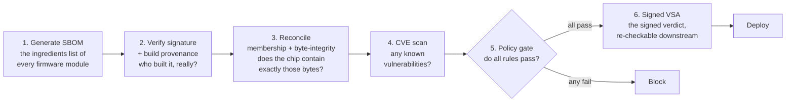
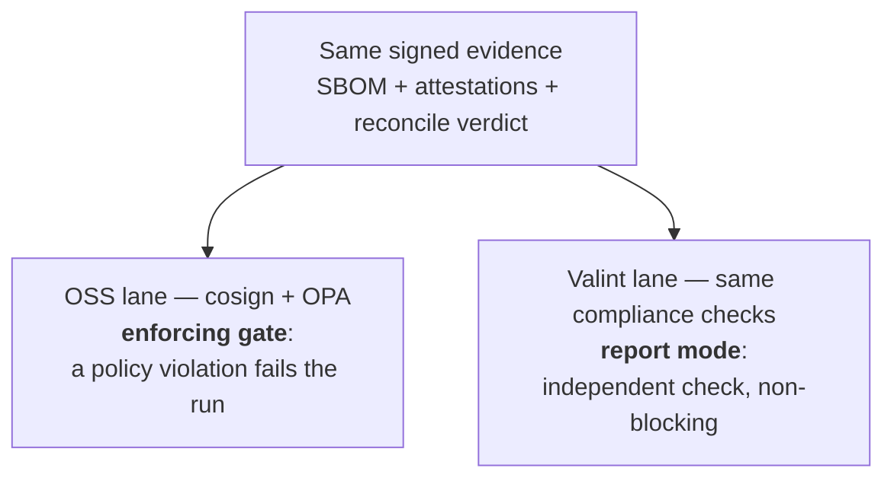

# firmware-sbom-supplychain

A working demo of a **firmware supply-chain verification gate** for a fleet operator, on the OVMF / edk2
reference target. It takes a build-time SBOM through the full pipeline and refuses to "deploy" anything that
fails policy — shown **two ways over the same evidence**:

- an **OSS lane** — `cosign` + Open Policy Agent (reproducible today with community-standard tools), and
- a **Valint lane** — signing + compliance policy with [Valint], the supply-chain evidence/policy tool.

Same firmware, same signed evidence. The **OSS lane is the hard gate** — a policy violation fails the run.
The **Valint lane runs the same compliance intent keyless** (via its rule/initiative bundles) but currently
in **report mode** (non-blocking), so it demonstrates the same evidence being checked by an independent
tool, not a second enforcement point. Honest scope, stated up front.

> **In plain language:** this project builds a signed "ingredients list" (an **SBOM**) for a firmware image,
> then *proves* the shipped chip really contains those exact bytes — and blocks the release if it doesn't.
>
> **New to firmware? Start with [PRIMER.md](PRIMER.md)** — it explains everything from scratch.

> **Design & rationale:** [`DESIGN.md`](DESIGN.md) — a discussion-framed write-up of the security /
> functional / operational design and the who-does-what boundary, written to double as the note that would
> attach to the upstream generator discussion (edk2 #10507). A proposal to open a conversation, not a mandate.

## Quickstart

```bash
make deps      # Python deps (PyYAML); see requirements.txt for the CLI tools (opa, jq, cosign, grype)
make test      # gate honesty tests — ALLOW a clean release, DENY each failure mode (16 negative fixtures + clean + triaged-allow, exercising all 18 reports)
make coverage  # per-framework, per-control compliance coverage from a fresh signed VSA
make demo      # the full OSS lane end to end (needs cosign + grype)
```

`make test` and `make coverage` are self-contained (opa + jq + python3/PyYAML). The gate itself is
[`oss-lane/policy/firmware.rego`](oss-lane/policy/firmware.rego) — **18 verifier reports** ANDed into a signed
SLSA VSA, each with an isolating negative fixture under [`oss-lane/fixtures/`](oss-lane/fixtures).

**Consumer side** — run the gate on *your own* firmware:

```bash
make verify FW=path/to/OVMF.fd VSA=vsa.intoto.json   # hash it, bind it, per-framework scorecard
```

[`cli/fw-supplychain-verify`](cli/README.md) hashes the image itself, checks the evidence is bound to *those
bytes*, and prints a `PASS / FAIL / MISSING_EVIDENCE` scorecard — degrading honestly to `MISSING_EVIDENCE` on
unattested firmware it has never seen.

## Documentation

Read in this order:

1. **[`PRIMER.md`](PRIMER.md)** — start here if you're new to firmware: what this does and why, from scratch.
2. **README** (this file) — what it is, how to run it.
3. [`DESIGN.md`](DESIGN.md) — the security / functional / operational design + the upstream-generator rationale.
4. [`FRAMEWORKS.md`](FRAMEWORKS.md) — the honest evidence→control map (exact section numbers; the 18 enforced
   reports over evidence atoms E1–E10).
5. [`oss-lane/compliance-map.md`](oss-lane/compliance-map.md) — the enforced subset + the two-lane story.
6. [`oss-lane/README.md`](oss-lane/README.md) — how the enforcing lane fits together (gate, assembler, fixtures).
7. [`EDK2-DEPENDENCY-RISK.md`](EDK2-DEPENDENCY-RISK.md) — the edk2 vendored-submodule risk map: maintenance /
   security posture of each dependency and the stale-pin / org-mirror attack surface.

Internal worklog (not product docs): [`DESIGN-REVIEW.md`](planning/DESIGN-REVIEW.md) (architecture review + verdict),
[`POLICY-EXPANSION.md`](planning/POLICY-EXPANSION.md) (the rule set), [`EVIDENCE-ROADMAP.md`](planning/EVIDENCE-ROADMAP.md)
(forward evidence lanes), [`TODO.md`](planning/TODO.md) (punch-list).

## The pipeline



In one line: `generate → verify(sig+provenance) → reconcile(bytes==SBOM) → CVE map → attest → OPA/compliance
gate → deploy`.

### Implementation status

The honest source of truth for what is actually built vs. designed. `DESIGN.md` describes the full intended
shape; this table says what exists. ✅ implemented · ⚠️ canned/stubbed · ❌ not built · ⛔ aspirational.

| Stage | Designed | Status |
|---|---|---|
| 1 — Generate declared SBOM | edk2 `-Y SBOM` | ✅ implemented (edk2 fork PR #6; CycloneDX 1.6, per-module SHA-256/512, firmware-image digest in `metadata.component`, CISA/BSI Tier-1 metadata; **311-component example committed** — the upstream generator emits 310, the demo enriches it with `openssl` as an in-image third-party dep, R1) |
| 2 — Observed carve → observed FFS | edk2 FMMT | ✅ implemented (`producers/reconcile/carve.sh` — FMMT decompresses the FVs and lists FFS `FILE_GUID`s) |
| 3 — Reconcile declared vs observed | `producers/reconcile/sbom-reconcile.py` + `byte-integrity.py` | ✅ **generated** (not canned) — real carve → verdict: 123/123 modules validated, 0 missing, 0 suspicious (*membership*). **Byte-integrity (R4) now real for the byte-checkable subset:** `byte-integrity.py` extracts each module's PE32 from the deployed `.fd` and matches it to the SBOM's declared hash — a **same-GUID trojan is detected** (gate report `component-byte-integrity`). XIP/PEI modules (rebased) are honestly reported as needs-canonicalization (R4 phase 3), never as tampered. |
| 4 — CDX → SPDX | protobom `sbom-convert` | ✅ implemented (`producers/interop/to-spdx.sh` + `inputs/sbom.spdx.json`) |
| 4b — CDX → coSWID + embed | uSWID | ✅ implemented (`producers/interop/to-coswid.sh` + `inputs/sbom.uswid`) — CDX→coSWID round-trips (310→311), and embeds into a PE `.sbom` section + re-extracts, verified |
| 5 — CVE map | grype | ✅ implemented (CI) |
| 6 — Attest + sign | cosign / Valint | ✅ implemented |
| 7 — Store to OCI | cosign | ✅ implemented (CI) |
| 8 — Policy gate | OPA / Valint | ✅ implemented (verifier-reports + SLSA VSA) |
| runtime — measured boot / RIM bind | TCG RIM / RATS | ⛔ aspirational, documented in DESIGN (not implemented) |

The enforcing gate (stages 5–8), the SPDX interop (4), and now the real observed-carve + reconcile (2/3) run
here; the generator (1) is edk2 fork PR #6. **Byte-integrity (R4) is now enforced** for the byte-checkable
module subset — a same-GUID trojan is caught (`component-byte-integrity`); XIP/PEI modules (rebased) await
canonicalization (R4 phase 3), reported honestly as needs-canon rather than tampered. Every other designed
stage now runs.

## The tools, in one line each

- **SBOM** (Software Bill of Materials) — the ingredient list of the firmware: every module, library, and
  third-party component, in [CycloneDX](https://cyclonedx.org) JSON.
- **[cosign](https://github.com/sigstore/cosign)** — sigstore's signing tool. It cryptographically signs
  the SBOM (and an attestation about it) and later verifies that signature. "Keyless" mode signs with a
  short-lived certificate tied to the CI job's identity (no long-lived private key).
- **[OPA](https://www.openpolicyagent.org)** (Open Policy Agent) — a policy engine. You hand it facts
  (JSON) and a policy written in *Rego*; it answers allow/deny. It does the *deciding*, not the gathering.
- **[Valint](https://github.com/scribe-public)** — a supply-chain evidence + policy tool (author: this
  project's author). It both *signs* evidence (like cosign) and *verifies compliance policies* against it,
  resolving named rules and whole-framework "initiatives" (SLSA, SSDF, SP-800-53) from a policy bundle.
- **[grype](https://github.com/anchore/grype)** — scans the SBOM's components for known CVEs.
- **reconcile** — this project's own check: carve the actual firmware binary and confirm it contains
  exactly what the SBOM claims (verify, don't trust).

The two lanes below run over the *same* signed evidence — one with cosign+OPA (the enforcing gate), one with
Valint (the same compliance checks, currently reporting) — so the result isn't tied to a single tool.

## Two lanes, side by side



| Step | `oss-lane/` | `valint-lane/` |
|---|---|---|
| **Sign evidence** | `cosign attest` (in-toto/DSSE) | `valint` signed evidence |
| **Verify signature** | `cosign verify-attestation` | `valint verify` (pulls the cosign/in-toto envelope) |
| **Policy / compliance** | `opa eval` over `policy/*.rego` | `valint verify` → YAML policy → sample-policy rego hierarchy |

Locally both sign with a key so the demo runs offline; the reference GitHub Actions workflow swaps that for
**keyless OIDC** signing (`cosign` via Fulcio/Rekor, using the runner's workload identity). *(The repo is public, so the SLSA provenance is generated by GitHub's attestation store via
`actions/attest-build-provenance` — platform-generated, SLSA Build L2 — and verified with `gh attestation
verify`, rather than a self-signed predicate.)*

## Compliance frameworks

The gate is the "compliance framework" engine. This repo ships one worked example end-to-end (SLSA
provenance + a custom firmware-composition policy) and a mapping showing how additional frameworks express
as policy rules:

- **SLSA** — build provenance at **L2**: GitHub's attestation store (`actions/attest-build-provenance`)
  generates and signs the SBOM's provenance from the run's metadata (platform-generated, not tenant-forgeable),
  verified in CI with `gh attestation verify`. L3 (isolated/hardened builder) is the remaining step. See
  [`FRAMEWORKS.md`](./FRAMEWORKS.md).
- **Custom firmware composition** — SBOM present ∧ signature verified ∧ reconcile clean ∧ no critical CVE ∧
  provenance bound to the trusted builder.
- **NIST SSDF (SP 800-218)** and **BSI TR-03183** — control→rule mapping in `oss-lane/compliance-map.md`.

## Honesty tests

`tests/` proves the gate actually blocks — not just passes a clean input:

- a **tampered SBOM** (fails reconcile),
- a **wrong builder identity** (fails provenance),
- an **injected critical CVE** (fails the CVE clause).

## Status

**Green on CI** (`.github/workflows/supply-chain.yml`), all keyless via the runner's OIDC identity. The
`attest-and-gate` job keyless-signs the SBOM **and a real SLSA provenance predicate**, verifies both, runs a
**grype** CVE scan (`anchore/scan-action`), assembles a gate input entirely from *verified* evidence
(signer identity extracted from the Fulcio cert, SBOM-hash ↔ signed-subject binding, reconcile verdict
decoded from the signed payload), enforces the **OPA gate** (with a **VEX allowlist** for triaged CVEs) and
keyless-signs its verdict as a **SLSA VSA** (Verification Summary Attestation),
runs fixture + in-pipeline negative tests, and demonstrates cosign's **native `verify-attestation --policy`**
over the OCI-stored SBOM. The `valint-lane` job signs + runs compliance keyless (report mode).

Locally the OSS lane runs end-to-end over real OVMF data (311-component SBOM, reconcile clean 123/123 →
ALLOW, emitting a signed SLSA VSA; honesty tests block tampered / wrong-builder / critical-CVE /
swapped-SBOM). Reference/demo,
defensive use only. Not affiliated with or endorsed by TianoCore.

## Trust model & honest limitations

The gate is only as trustworthy as its inputs, so it's worth being explicit about what it does and
doesn't protect:

- **Actions are pinned to commit SHAs** (not mutable tags), and each job takes the **minimum token scope**
  (only `attest-and-gate` gets `id-token: write`, for keyless signing).
- **The gate's decision inputs live in the repo** — `inputs/reconcile-verdict.json` (the reconcile
  predicate), `oss-lane/policy/cve-allowlist.json` (VEX), and `oss-lane/policy/data.json` (the expected
  builder identity). A commit that edits these can change the verdict, so they are covered by
  [`CODEOWNERS`](.github/CODEOWNERS) and **require branch protection on `main`** to be meaningful. Signing
  does *not* protect them — they're inside the signed repo.
- **Demo limitation:** in this demo the reconcile verdict is *committed*, not regenerated in CI (CI has the
  SBOM but not the multi-hundred-MB firmware image to re-carve). A real operator pipeline would **regenerate
  the reconcile verdict inside the isolated builder** from the actual firmware, so the gate *proves* the
  bytes rather than *trusting* a committed file. That's the intended production shape; the demo shows the
  policy/attestation machinery around it.
- The local runner's `DEV_ASSUME_IDENTITY` fallback (used only when signing with a local key, which carries
  no cert identity) is **unreachable in CI** — CI keyless signing always yields a real, extracted signer
  identity. A local `ALLOW` therefore proves less than a CI `ALLOW`.

[Valint]: https://github.com/scribe-public
