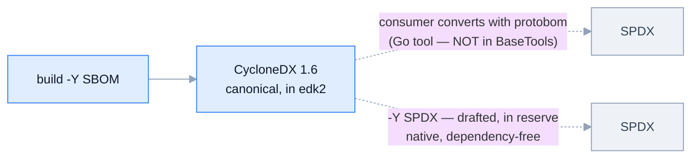

> **DRAFT — pending review, not yet posted upstream.** Nothing here has been sent to the list or the tracker.

---

Hi — I'm an engineer working on firmware reverse-engineering and software supply-chain, and I put together the
build-time SBOM generator this issue asks for. Rather than another design write-up, here's working code and two
concrete questions.

**Two questions for the maintainers:**

1. Is a `-Y SBOM` report type in `BuildReport.py` the right home for this, or would you prefer a standalone
   script under `BaseTools`?
2. CycloneDX as the canonical format with conversion for SPDX consumers, or should the generator emit SPDX
   natively too?

## What it is

A new `-Y SBOM` build report type that emits a **CycloneDX 1.6** SBOM by reusing the AutoGen data already
gathered for `-Y COMPILE_INFO` — so it adds **no new build dependency** (CycloneDX is plain JSON). It answers
the gap #6455 left: a *static* template landed, but nothing that produces an SBOM from a real build.

A full OvmfPkgX64 (DEBUG/GCC) build yields a 310-component SBOM: one component per built module and resolved
library instance, a module → library dependency graph, per-module SHA-256/512 hashes (of the rebased image,
reusing the `-Y HASH` canonicalization), and edk2 module-type / arch / `.inf` metadata.

Working branch (personal fork — happy to send to `devel@edk2.groups.io` via `git send-email` if there's
interest): https://github.com/houdini91/edk2/pull/6 (the `-Y SBOM` generator, plus the drafted `-Y SPDX`
report type in reserve). A generated example SBOM and a longer write-up are in the reference repo:
https://github.com/houdini91/firmware-sbom-supplychain .

## On format (CycloneDX vs SPDX)

CycloneDX is the canonical emit; SPDX can be had two ways, and I'm proposing only the first:

To be explicit: **protobom is not proposed for BaseTools** — it's how a *consumer* converts, entirely outside
the build. And native `-Y SPDX` is drafted (same generator, dependency-free) and ready if you'd prefer it, but
I'm deliberately not bundling a second format into this proposal.

## What is *not* proposed here

Being upfront so this doesn't read as bigger than it is:

- **Third-party submodule components** (openssl, brotli … with `purl` / version) are a natural next increment
  but are **not emitted yet**.
- The **verification side** — reconstructing an SBOM from the shipped binary, reconciling declared-vs-observed,
  signing, a policy gate, measured boot — is deliberately **operator-side and NOT proposed for edk2**. edk2
  ships source, not signed firmware, so that machinery living here would be dead infrastructure; it belongs to
  whoever builds and consumes the image.

So the only upstream ask is the generator (optionally plus native SPDX later). Thanks for reading.
